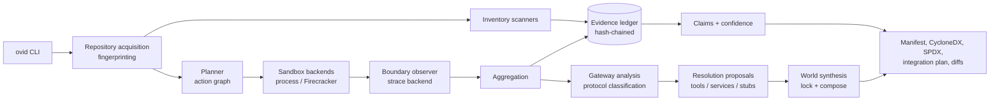

# Ovid

**Repository execution tomography: evidence-driven analysis of how a
repository is built, executed, and integrated.**

Ovid takes a repository (local path or Git URL), inventories what it
*declares*, executes its workloads under boundary observation to see what
it *actually does*, and emits an evidence-backed manifest: components,
required tools, external services, listeners, causal classifications, and
a reproducible integration-world proposal. Every conclusion links back to
immutable, hash-chained evidence — Ovid can always answer
*"why do you believe this?"*

## Purpose

Conventional SBOMs say a package is declared or installed. They cannot say
whether it is exercised, which undeclared build tools were needed, which
databases and services the code actually contacts, or whether a dependency
is required or optional. Ovid closes that gap with a hybrid model:

- **static inventory** supplies declared/resolved composition
  (manifests + lockfiles across Cargo, npm/pnpm/yarn, Python, Go,
  Maven/Gradle, RubyGems, Composer);
- **dynamic observation** watches real execution boundaries (process
  exec, file opens *and misses*, stat-scan misses, socket connects,
  listeners) via an interchangeable observer backend;
- **active experimentation** establishes causality: failed operations
  seed resolution proposals, and counterfactual reruns separate
  *required* from *optional* dependencies;
- **explicit unresolved reporting** keeps unknowns visible instead of
  guessing.

## Features

- `ovid inventory` — non-executing static inventory with language stats,
  merged declared+resolved components, PURL normalization.
- `ovid observe` — run one explicit command in a supervised sandbox
  (scrubbed environment, ephemeral copy-on-write workspace, resource
  limits, deadlines) under strace-based boundary observation.
- `ovid analyze` — discover build/test commands from CI files, package
  scripts, Makefiles, Dockerfiles, and docs; execute them; propose
  resolutions for missing tools (via tool-resolver packs) and refused
  services (via service packs); synthesize a proposed world lock and
  Compose replay file; run environment-variable counterfactuals.
- `ovid tomography` — the full loop in one command: discover workloads,
  run each **twice** (first in an isolated network namespace with
  deny-all egress and loopback intact, then with network access), and
  classify every external dependency from the counterfactual pair
  (`required` only when a single controlled dependency flips the
  outcome; group-level changes stay honestly `unresolved`). One bundle
  carries both runs, the experiment evidence, and the world lock.
- **DNS identity capture** — resolver traffic (port 53) is decoded from
  observed syscalls into DNS query/answer evidence, so external
  dependencies are identified by *hostname* (grouping CDN address
  rotation into one logical dependency), resolver bypass (queries sent
  to servers not in `/etc/resolv.conf`, e.g. hardcoded `8.8.8.8`) is
  flagged, and destinations with no observed resolution are explicitly
  marked `ip-only` rather than silently nameless.
- `ovid explain` — traverse any claim to its supporting evidence.
- `ovid diff` — compare two analyses (components, versions, external
  systems, listeners, tools).
- `ovid world export` — emit the world lock or a Compose replay.
- `ovid packs` — list/validate declarative packs.
- **Evidence ledger**: append-only, hash-chained JSONL with tamper
  detection; the chain head is published in every manifest's provenance.
- **Exports**: Ovid manifest (YAML/JSON), CycloneDX 1.5, SPDX 2.3,
  integration plan (Markdown), world lock, Compose.
- **Pack extensibility**: runner recipes, service packs, protocol
  classifiers, and tool resolvers as schema-validated YAML — new
  ecosystem support without core code changes.

## Design



Key decisions (full detail in [docs/ARCHITECTURE.md](docs/ARCHITECTURE.md)):

- **The evidence ledger is canonical.** Manifests, claims, and exports
  are projections; ledger records are immutable and hash-chained.
- **Claim states never collapse.** `declared`, `resolved`, `loaded`,
  `exercised`, `causally_required` are independent dimensions; static
  scanners can never set dynamic states.
- **Failures are first-class.** An `execve`/stat `ENOENT` or an
  `ECONNREFUSED` is evidence that seeds the resolution loop.
- **Causality requires counterfactuals.** `required`/`optional` labels
  come only from rerun comparisons or natural counterfactuals (workload
  succeeded while a dependency was down); everything else is
  `unresolved`.
- **Two execution backends.** A supervised process sandbox (trusted
  repositories; works everywhere) and a Firecracker MicroVM layer
  (untrusted code; jailer + read-only source device + overlay + vsock +
  snapshots) that fails closed on hosts without KVM. Manifests always
  record which isolation tier produced the evidence.
- **Packs over analyzers.** Ecosystem knowledge is declarative YAML
  evaluated by generic code.

## Getting started

### Prerequisites

- Linux, Rust 1.85+ (`rustup` recommended)
- `strace` for boundary observation (`apt-get install strace`)
- `git` for URL-based acquisition
- Optional: `/dev/kvm` + Firecracker for the MicroVM backend

### Build and run

```sh
cargo build --release
alias ovid=target/release/ovid

# Static inventory of a repository
ovid inventory https://github.com/sharkdp/fd --ref master

# Observe an explicit command (trusted repo, ephemeral workspace)
ovid observe . --run 'cargo test' --inherit-env PATH --inherit-env HOME

# Full local analysis: discover workloads, observe, synthesize a world
ovid analyze . --workloads build,test --inherit-env PATH --inherit-env HOME

# Offline/online counterfactual pair with one bundle (network causality)
ovid tomography . --workloads test --inherit-env PATH --inherit-env HOME

# Why do you believe this?
ovid explain claim:01J... --from ovid-output
ovid explain postgres --from ovid-output          # substring search

# Compare two revisions' bundles
ovid diff --before out-v1/ --after out-v2/
```

Every analysis writes a bundle:

```text
ovid-output/
├── ovid.yaml / ovid.json     # the manifest (human / machine, same document)
├── evidence.jsonl            # immutable hash-chained evidence ledger
├── claims.json               # normalized claims with evidence links
├── cyclonedx.json, spdx.json # standards exports
├── world.lock.yaml           # reproducible world (analyze mode)
├── compose.yaml              # local replay environment (analyze mode)
└── integration-plan.md       # human-readable plan
```

`ovid.yaml` is written in reading order with section banners: a
`summary` section (headline, counts, ranked findings) comes first, the
dynamic story (workloads, external systems, unresolved, completeness)
follows, and the bulk inventory sits near the end. `summary.findings`
is typed (`severity`, `kind`, `subject`, `detail`) so CI and agents can
gate on it without parsing prose; provenance (tools, packs, evidence
chain head) closes the manifest.

### Notes on trust

The process backend is for repositories you trust: it scrubs the
environment, isolates writes into an ephemeral workspace, and enforces
resource limits, but it is **not** a security boundary against hostile
code. Hostile-repository analysis requires the Firecracker backend on a
Linux/KVM worker (see `docs/ARCHITECTURE.md#execution-backends`).

## Testing

```sh
cargo test --workspace                                   # unit + integration + golden
cargo test -p ovid-cli --test perf -- --ignored --nocapture  # perf guardrails
UPDATE_GOLDENS=1 cargo test -p ovid-cli --test golden    # regenerate goldens
```

Validation against real open-source repositories (performance and
accuracy measurements) is documented in
[docs/VALIDATION.md](docs/VALIDATION.md) and reproducible with
`scripts/validate-oss.sh`.

## Troubleshooting

| Symptom | Cause / fix |
|---|---|
| `strace unavailable: boundary observation was not captured` in limitations | Install strace (`apt-get install strace`). The run still completes; only observation is missing. |
| `observe` fails with `spawn "cargo": No such file or directory` | The sandbox scrubs `PATH` to system defaults. Pass `--inherit-env PATH` (and usually `--inherit-env HOME` for toolchain caches like `~/.cargo`). |
| Workload needs network (dependency download) but hangs/fails | The sandbox does not provide a registry proxy in process mode; run the dependency-fetch step yourself first, or use `--in-place` against a pre-fetched checkout. |
| `git clone failed` for a URL | Check the ref (`--ref`), network access, and credentials; Ovid clones with hooks disabled and never runs repo code during acquisition. |
| `UnsupportedHost: /dev/kvm not present` | You asked for the Firecracker backend on a host without KVM. Use the process backend (default) for trusted repos, or provision a Linux/KVM worker. |
| `tomography` offline run warns about missing isolation | `unshare -r -n` (unprivileged user namespaces) is unavailable — often disabled via `kernel.unprivileged_userns_clone=0` or distro hardening. The offline run falls back to stripping proxy variables and says so in limitations. |
| External systems show `identity: ip-only` | No DNS resolution was observed for those destinations (e.g. the address was hardcoded, or resolution happened before observation started). The manifest lists how many, so absence of a name reads as unknown, not nameless. |
| Analysis is slow on a huge repository | Use `--in-place` to skip the ephemeral copy (trusted checkouts only), and prefer `inventory` mode for fleet-style sweeps. |
| Golden test failure after your change | Expected if output changed intentionally — regenerate with `UPDATE_GOLDENS=1` and commit the diff; otherwise you introduced a regression. |
| `pack validation failed` | Packs must have `api_version: ovid.dev/pack/v1` and digest-pinned service images. Run `ovid packs validate <dir>` for the exact error. |
| Ledger `chain break at record …` | The evidence file was edited or truncated. Evidence is immutable; rerun the analysis. |

## Repository layout

```text
crates/            13-crate workspace (core -> evidence -> ... -> cli)
packs/             built-in declarative packs (runners, services, protocols, resolvers)
fixtures/          test fixture repositories + golden files
scripts/           validation and maintenance scripts
docs/              architecture, validation results
.claude/skills/    task playbooks for consistent future development
```

## License

Apache-2.0
