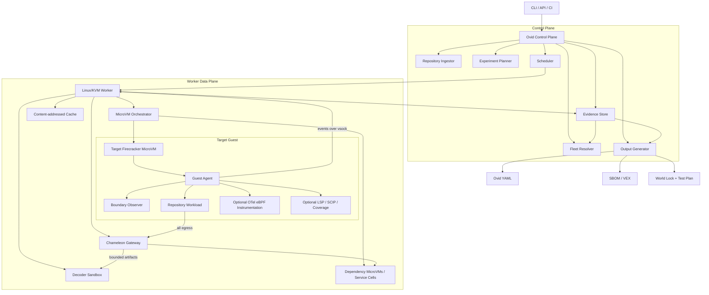
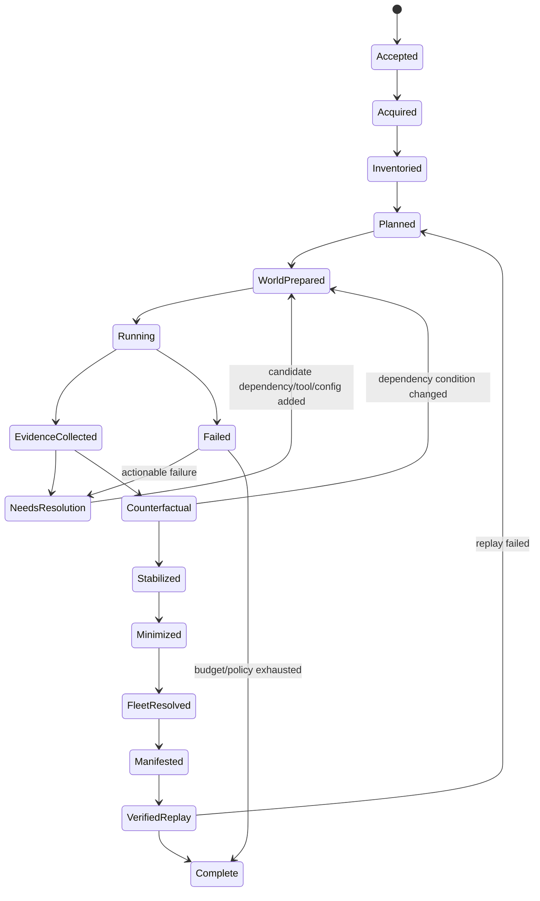
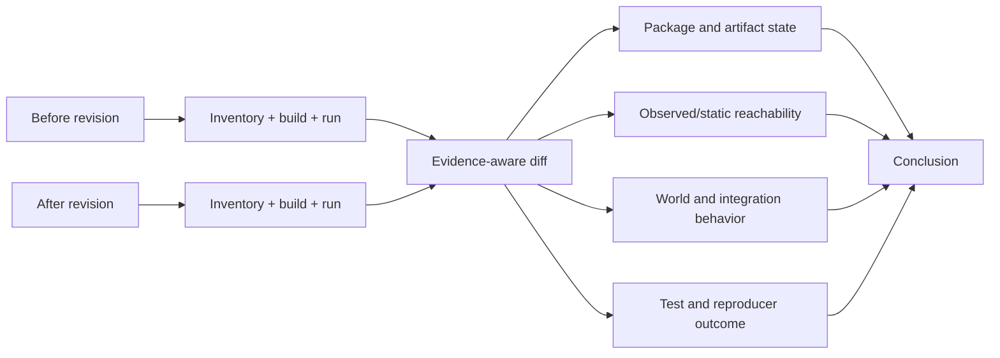
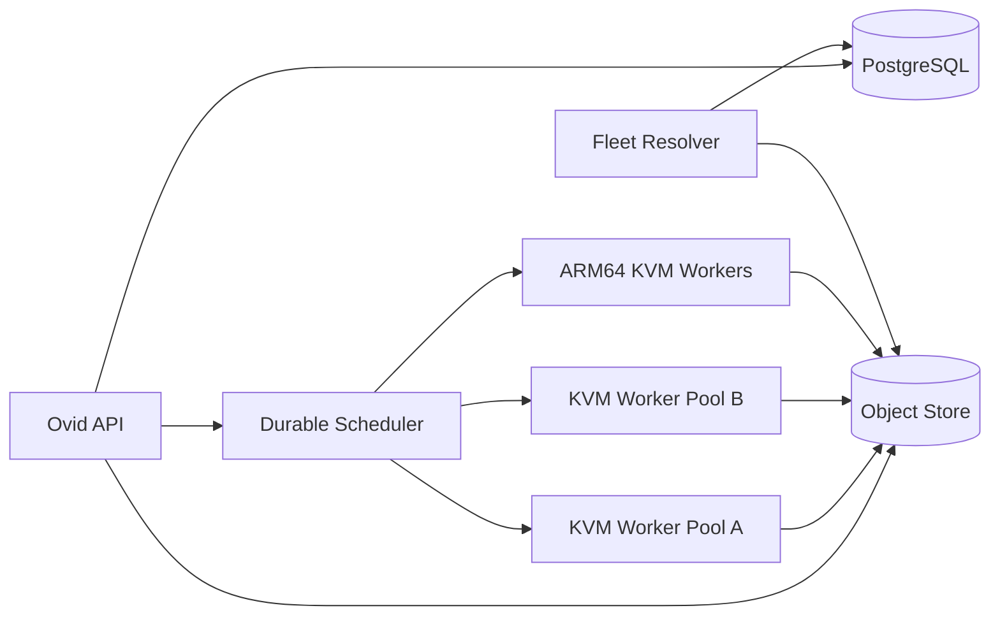

# Ovid

## Repository Execution Tomography and Integration Environment Synthesis

**Technical product and engineering specification**  
**Version:** 0.1-draft  
**Date:** 2026-08-20  
**Status:** Proposed  
**Primary implementation language:** Rust  
**Default execution substrate:** Firecracker MicroVMs on Linux/KVM

## Contents

1. [Vision, goals, and product boundary](#1-executive-summary)
2. [Architecture and execution modes](#9-high-level-architecture)
3. [Functional and non-functional requirements](#11-functional-requirements)
4. [Detailed components and execution lifecycle](#13-detailed-component-design)
5. [Generic pack-based extensibility](#15-generic-extensibility-model)
6. [MicroVM, gateway, and active experimentation](#16-microvm-and-guest-design)
7. [Evidence, graph, manifest, and world schemas](#22-evidence-model)
8. [Vulnerability validation and security model](#29-vulnerability-and-remediation-validation)
9. [Implementation, deployment, and evaluation](#34-implementation-architecture)
10. [Delivery plan, decisions, prototype, and references](#38-phased-delivery-plan)

---

## 1. Executive summary

Ovid is a self-hosted system for understanding how a source repository is built, executed, integrated, and tested. Given a repository URL and revision, Ovid should produce an evidence-backed manifest describing:

- the software components and system packages present in the repository and built artifacts;
- the runtimes, compilers, package managers, native libraries, tools, and files required to build and run it;
- the processes, listeners, external services, databases, queues, topics, cloud APIs, filesystems, and local IPC endpoints it actually attempts to use;
- the source-level and runtime call paths associated with those interactions when attribution is available;
- the upstream and downstream repository relationships that can be resolved across a fleet;
- the smallest credible environment required to execute a specified workload successfully;
- what should be started as a real dependency, emulated, stubbed, or left unresolved for integration testing;
- whether a dependency upgrade or vulnerability remediation changed the relevant software, execution path, behavior, or integration requirements.

Ovid is not primarily a universal static analyzer. Its central mechanism is **repository execution tomography**:

1. place the repository inside an isolated and instrumented MicroVM;
2. attempt to build, test, start, and exercise it;
3. observe every meaningful boundary crossed by the workload;
4. treat both successful and failed operations as evidence;
5. satisfy missing requirements one at a time using controlled services, tools, files, configuration, or adaptive stubs;
6. restore a clean snapshot and rerun experiments;
7. perform counterfactual experiments to distinguish required, optional, incidental, and test-only dependencies;
8. correlate runtime evidence with SBOM tools, package metadata, standard code-intelligence protocols, configuration, and fleet-wide observations;
9. emit a reproducible **Ovid Manifest**, CycloneDX/SPDX exports, an integration-world definition, and a detailed evidence ledger.

The design intentionally avoids implementing analyzers for every combination of language, framework, SDK, and service. Ovid concentrates custom code around a small set of stable boundaries:

- process execution;
- file and library access;
- network connections and listeners;
- DNS and protocol operations;
- package and artifact downloads;
- build inputs and outputs;
- source symbols exposed through LSP or SCIP;
- experimental outcomes.

Language, toolchain, protocol, and service support is added primarily through declarative recipes and reusable external providers rather than compiled framework-specific analyzers.

---

## 2. Problem statement

A conventional SBOM can establish that a package is declared, resolved, installed, or present in an artifact. It usually cannot establish all of the following:

- whether the package is loaded or exercised by a particular workload;
- which build tools and undeclared system files were required;
- which external systems the code attempts to contact;
- which concrete API methods, database operations, queues, topics, or cloud resources are involved;
- whether a dependency is mandatory or optional;
- what must be started to run a credible integration test;
- which other repositories provide or consume the observed interfaces;
- whether the relevant path still exists after remediation;
- whether a test passed only because an undeclared dependency happened to exist in the ambient environment.

Static analysis can improve this picture, but a fully semantic implementation across Python, Java, Scala, Kotlin, JavaScript, TypeScript, Go, Rust, Zig, Perl, C, C++, .NET, Ruby, PHP, shell, generated code, build languages, and domain-specific configuration becomes a large collection of bespoke frontends. It also remains incomplete in the presence of reflection, runtime configuration, generated clients, dynamically assembled destinations, plugins, feature flags, and external build steps.

Dynamic execution has the opposite limitation: it can show what happened during a run, but not prove what could happen in unexecuted paths. Ovid therefore uses a hybrid model in which:

- dynamic observation supplies high-confidence facts about executed behavior;
- active experimentation establishes causal necessity and minimal environments;
- static inventory supplies declared and artifact-level composition;
- LSP/SCIP and runtime stacks enrich source attribution;
- fleet-wide matching derives reverse dependencies that cannot be known from a single repository;
- explicit completeness and unresolved sections prevent absence-of-observation from being presented as proof of absence.

---

## 3. Product definition

### 3.1 One-sentence definition

> Ovid is an evidence-driven repository experimentation engine that synthesizes the minimum build, runtime, and integration world for a source revision using isolated execution, boundary observation, active dependency resolution, standardized code intelligence, and fleet-wide service matching.

### 3.2 Primary artifact

The primary artifact is an **Ovid Manifest** rather than a plain SBOM. The manifest is a revision-scoped, workload-scoped summary generated from an immutable evidence ledger.

A typical analysis bundle contains:

```text
ovid-output/
├── ovid.yaml                         # Human-readable normalized manifest
├── ovid.json                         # Machine-oriented equivalent
├── evidence.jsonl.zst                # Immutable normalized evidence events
├── evidence.parquet                  # Optional analytics projection
├── cyclonedx.json                    # Standards-compatible component/service BOM
├── spdx.json                         # Optional SPDX export
├── world.lock.yaml                   # Reproducible integration-world lock
├── integration-plan.md               # Human-readable test-environment plan
├── compose.yaml                      # Optional local replay environment
├── kubernetes/                       # Optional Kubernetes replay manifests
├── stubs/                            # Generated, evidence-backed service stubs
├── pcaps/                            # Optional bounded packet captures
├── logs/                             # Redacted process and test logs
└── provenance.json                   # Tool, image, policy, and input digests
```

### 3.3 Name

The project name is **Ovid**. The name is not required to be an acronym. Where an expansion is useful in documentation, **Observed Verification and Integration Discovery** may be used, but the product should ordinarily be referred to simply as Ovid.

---

## 4. Goals

### G-1: Produce a trustworthy repository operating model

For a given revision and one or more workloads, identify the components, tools, system dependencies, files, external interfaces, and integration systems that were declared, attempted, observed, exercised, and experimentally required.

### G-2: Remain broadly language-agnostic

Support Linux-compatible repositories across major programming languages without implementing a compiler frontend or framework detector for every ecosystem. Language-specific knowledge should be limited to declarative launch recipes and optional standard code-intelligence providers.

### G-3: Generate actionable integration environments

Produce a reproducible plan describing what should be started as a real service, supplied as a fixture, emulated, stubbed, or left unresolved. The generated world must include startup order, configuration, aliases, ports, initialization, health checks, and evidence.

### G-4: Establish true downstream and fleet-derived upstream relationships

Observe outbound interactions directly. Derive reverse callers by matching observations against other repositories, deployment identities, server-side interfaces, or distributed traces. Preserve ambiguity rather than inventing a single owner.

### G-5: Validate dependency and vulnerability changes

Compare revisions or artifacts to establish whether a dependency changed, whether vulnerable code is still present or exercised in the selected workloads, whether integration behavior regressed, and what systems are required to reproduce the relevant path.

### G-6: Be safe enough for hostile repositories

Treat repository content, build scripts, test code, generated binaries, package artifacts, protocol payloads, and service images as potentially malicious. No repository code may execute directly on the worker host.

### G-7: Scale to large repository fleets

Use content-addressed caches, warm snapshots, bounded experiments, immutable evidence, and horizontally scalable workers. Avoid requiring a deep semantic analysis pass for every repository before useful data can be produced.

### G-8: Be explainable

Every material conclusion must link to one or more evidence records, experiments, files, processes, packets, spans, package artifacts, symbols, or fleet matches. Ovid must be able to answer, “Why do you believe this?”

---

## 5. Non-goals

Ovid v1 is not intended to:

1. prove that an unobserved code path or dependency cannot exist;
2. replace SAST, SCA, fuzzers, code review, or production observability;
3. implement compiler-accurate call graphs for every language internally;
4. perfectly emulate arbitrary proprietary protocols or business services;
5. execute code with production credentials or unrestricted internet access;
6. infer all external callers from a single isolated repository;
7. guarantee exploitability or non-exploitability solely from package presence or absence;
8. run Windows or macOS kernels inside the initial Firecracker implementation;
9. automatically trust repository-provided Dockerfiles, CI images, scripts, or dependencies;
10. treat LLM-generated suggestions as evidence without successful experimental validation;
11. make a negative security assertion from dynamic non-observation alone;
12. require a graph database, Kubernetes, or a distributed control plane for local use.

---

## 6. Design principles

### 6.1 Observe boundaries, not frameworks

The durable abstraction is not “Spring application,” “FastAPI application,” or “Kafka Java client.” It is:

- a process executed a binary;
- a process opened or mapped a file;
- a process attempted a socket connection;
- a listener accepted a connection;
- an HTTP, RPC, SQL, messaging, or storage operation crossed a boundary;
- a build produced an artifact;
- a workload succeeded or failed under a controlled condition.

Framework knowledge may enrich evidence, but the core graph must remain meaningful without it.

### 6.2 Failed operations are first-class evidence

Examples:

```text
execve("protoc")                         -> ENOENT
openat("/usr/include/openssl/ssl.h")     -> ENOENT
connect("orders", 5432)                 -> ECONNREFUSED
DNS query "payments.default.svc"         -> NXDOMAIN
openat("/etc/ovid-example.yaml")         -> ENOENT
```

Each event can become a candidate requirement and a new experiment.

### 6.3 Dynamic facts and static possibilities must remain distinct

Ovid must never collapse these statements into one:

- package is declared;
- package was resolved;
- package was downloaded;
- package was included in an artifact;
- package file was opened;
- package code was executed;
- package is statically reachable;
- package was exercised by a successful workload;
- package is causally required for the workload.

### 6.4 The evidence ledger is canonical

The graph and YAML are projections. Raw normalized observations and experiment outcomes are immutable, versioned, and content-addressed.

### 6.5 Facts require provenance

An LLM, heuristic, or resolver may propose an action. It cannot directly create a confirmed fact. A fact is promoted only after a trusted provider or experiment produces evidence.

### 6.6 Prefer precision over forced resolution

An unresolved endpoint or ambiguous service match is preferable to a confident but incorrect architecture graph.

### 6.7 Fast, progressive depth

Ovid should produce useful inventory quickly, then deepen confidence through execution, protocol decoding, counterfactual tests, source attribution, and fleet correlation.

### 6.8 No host execution

All repository-controlled code, package hooks, language servers, protocol dissectors processing untrusted payloads, SBOM scanners processing untrusted archives, and adaptive stubs must run in an appropriate sandbox.

### 6.9 Support is capability-based

A language is not simply “supported” or “unsupported.” Ovid reports separate capabilities:

- repository detection;
- toolchain provisioning;
- build/test/start execution;
- source SBOM;
- artifact SBOM;
- dynamic library/module observation;
- runtime stack attribution;
- LSP call hierarchy;
- SCIP indexing;
- coverage integration.

---

## 7. Users and primary use cases

### 7.1 Security remediation engineer

Needs to establish whether a vulnerable component is present, loaded, exercised, reachable from a relevant workload, and removed or bypassed after remediation. Needs a reproducible environment and a clear before/after evidence trail.

### 7.2 Platform or integration engineer

Needs to understand what services, databases, queues, cloud APIs, tools, configuration, and initialization are necessary to run a repository’s integration tests.

### 7.3 Repository fleet owner

Needs a normalized software graph across thousands of repositories, including callers, callees, dependency versions, service contracts, and impact paths.

### 7.4 Test engineer or agent

Needs an executable integration-world plan, generated fixtures and stubs, health checks, and a way to confirm that the environment is sufficient for a target scenario.

### 7.5 Developer

Needs to understand why a build fails in a clean environment, which undeclared tool or file was used, and what changed between revisions.

### 7.6 Governance or architecture team

Needs evidence-backed answers to questions such as:

- Which repositories contact service X?
- Which services expose endpoint Y?
- Which repositories still require Java 17, PostgreSQL 13, or OpenSSL 1.x?
- Which applications publish or consume topic Z?
- What will need regression testing if repository B changes?
- Which vulnerable components are present but not observed in selected production-like scenarios?

---

## 8. Core concepts and terminology

### 8.1 Repository revision

The immutable combination of repository identity, commit digest, submodule state, and optional large-file pointers.

### 8.2 Workload

A user-visible objective Ovid attempts to execute. Examples:

- `build`;
- `unit-tests`;
- `integration-tests`;
- `start-server`;
- `POST /checkout` scenario;
- CLI command `import --file sample.csv`;
- vulnerability reproducer;
- custom success predicate.

The same repository can produce different dependency worlds for different workloads.

### 8.3 Run

A single execution of one command or scenario in a defined world from a known snapshot.

### 8.4 Experiment

One or more runs that vary a controlled condition: availability, response, latency, environment variable, file, tool, service implementation, feature flag, or input.

### 8.5 World

The complete isolated environment for an experiment:

- target MicroVM;
- dependency MicroVMs or service cells;
- virtual network and DNS;
- files, configuration, environment, and secrets;
- gateway behavior;
- initialization and probes;
- toolchain and package artifacts.

### 8.6 Minimum Viable World

The smallest experimentally verified world in which a workload satisfies its success predicate. A world is minimal only relative to a specified workload, policy, and experiment budget.

### 8.7 Boundary event

A normalized event representing a process, file, library, network, protocol, build, artifact, test, or outcome boundary.

### 8.8 Claim

A normalized graph statement derived from evidence, such as:

```text
workload integration-tests REQUIRES service postgres
process checkout-server CALLS endpoint POST /v1/charge
repository checkout CALLS repository payments
package reqwest@0.12 IS_EXERCISED_BY workload checkout-api
```

### 8.9 Evidence

A concrete observation or provider result supporting or contradicting a claim. Evidence is immutable and includes origin, time, trust tier, run, tool version, and content digest.

### 8.10 Pack

A signed, versioned, primarily declarative extension. Pack types include:

- runner recipe;
- tool resolver;
- protocol classifier;
- service provider;
- code-intelligence provider;
- export adapter;
- success probe.

### 8.11 Boundary coverage

A language-independent exploration signal measuring discovery of new processes, files, listeners, destinations, operations, services, topics, queues, errors, and artifacts.

### 8.12 Fleet graph

The merged graph for many repository revisions and optional deployment/service-catalog observations. This is where Ovid can derive credible reverse callers and transitive integration impact.

---

## 9. High-level architecture



### 9.1 Control plane responsibilities

- accept requests and policies;
- resolve repository identity and revision;
- schedule and budget experiments;
- manage evidence and artifact metadata;
- coordinate fleet-wide matching;
- generate manifests and comparisons;
- expose explanations and queries.

### 9.2 Worker responsibilities

- safely clone or materialize source;
- construct read-only repository block images;
- restore and run MicroVM snapshots;
- host the isolated network and dependency gateway;
- collect guest and host observations;
- run service cells and decoder sandboxes;
- enforce resource and egress policy;
- upload immutable evidence and artifacts.

### 9.3 Guest responsibilities

- supervise repository commands;
- observe guest process/file/socket behavior;
- report exit status and test results;
- run optional standard instrumentation and code-intelligence tools;
- provide no direct access to host paths or credentials.

---

## 10. Analysis modes

### 10.1 `inventory`

No repository code is intentionally executed. Ovid:

- inventories files and build metadata;
- runs sandboxed SBOM providers against source and prebuilt artifacts;
- records repository-declared commands and environment hints;
- emits an initial manifest with explicit static provenance.

Use for quick fleet ingestion or repositories that cannot be executed.

### 10.2 `observe`

Runs one or more explicit user-supplied commands in a MicroVM and captures boundary behavior. It does not automatically satisfy missing dependencies beyond configured package/tool access.

### 10.3 `explore`

Runs the active experiment loop:

- discovers candidate workloads;
- supplies missing tools and infrastructure;
- generates probes and adaptive stubs;
- explores new boundary edges;
- performs dependency causality and minimization tests.

### 10.4 `fleet`

Merges results across repositories, resolves caller/provider relationships, and can recursively start peer repositories to construct a multi-repository world.

### 10.5 `validate`

Compares revisions, artifacts, manifests, or vulnerability states. It reruns equivalent workloads under a locked policy and reports composition, behavior, reachability, and integration changes.

---

## 11. Functional requirements

Priorities use **MUST**, **SHOULD**, and **MAY** in the RFC sense.

### 11.1 Repository acquisition

| ID | Requirement | Priority |
|---|---|---|
| FR-001 | Accept Git URLs, local paths, archives, and prebuilt OCI images. | MUST |
| FR-002 | Resolve and record an immutable commit digest. | MUST |
| FR-003 | Support credentials through short-lived worker-scoped brokers without exposing them to the workload. | MUST |
| FR-004 | Support shallow and partial clones where compatible with the requested analysis. | SHOULD |
| FR-005 | Record submodule, Git LFS, sparse-checkout, and generated-source state. | SHOULD |
| FR-006 | Deduplicate repository materialization by content digest and policy domain. | MUST |
| FR-007 | Never mount a writable host checkout directly into an untrusted guest. | MUST |

### 11.2 Workload discovery and planning

| ID | Requirement | Priority |
|---|---|---|
| FR-010 | Accept explicit build, test, start, probe, and success commands. | MUST |
| FR-011 | Mine candidate commands from container metadata, CI files, build files, package scripts, Makefiles, documentation, and prior successful fleet runs. | SHOULD |
| FR-012 | Represent candidates in a language-neutral action graph. | MUST |
| FR-013 | Score commands by source, confidence, expected cost, and risk. | MUST |
| FR-014 | Allow an optional local LLM to propose commands and scenarios. | MAY |
| FR-015 | Require experiment validation before promoting proposed commands into reusable recipes. | MUST |
| FR-016 | Support user-defined success predicates. | MUST |
| FR-017 | Preserve separate worlds for build, unit test, integration test, startup, and custom scenarios. | MUST |

### 11.3 Execution isolation

| ID | Requirement | Priority |
|---|---|---|
| FR-020 | Execute repository-controlled code inside Firecracker MicroVMs by default. | MUST |
| FR-021 | Start Firecracker through the jailer or equally restrictive controls. | MUST |
| FR-022 | Use immutable kernels and base root filesystems identified by digest. | MUST |
| FR-023 | Attach source as a read-only block device and writes through an ephemeral overlay. | MUST |
| FR-024 | Apply CPU, memory, process, disk, I/O, time, and network budgets per run. | MUST |
| FR-025 | Reset to a clean snapshot between experiments unless the world explicitly models persistence. | MUST |
| FR-026 | Support warm snapshots and copy-on-write disks. | SHOULD |
| FR-027 | Provide an optional faster gVisor/container backend for trusted repositories. | MAY |
| FR-028 | Run dependency services in separate isolation cells rather than directly on the worker host. | MUST |

### 11.4 Boundary observation

| ID | Requirement | Priority |
|---|---|---|
| FR-030 | Capture process start, exec, exit, parentage, executable identity, arguments, user, and namespace. | MUST |
| FR-031 | Capture relevant file opens, misses, writes, executable mappings, and shared-library mappings. | MUST |
| FR-032 | Capture socket connect, failure, bind, listen, accept, local/remote tuple, and process attribution. | MUST |
| FR-033 | Capture DNS requests and responses from the host gateway. | MUST |
| FR-034 | Capture package/artifact downloads with URL, digest, media type, and requesting process where resolvable. | MUST |
| FR-035 | Capture HTTP, RPC, SQL, messaging, cache, and object-storage operations when supported by standard instrumentation or decoders. | SHOULD |
| FR-036 | Capture build artifacts and filesystem deltas. | MUST |
| FR-037 | Preserve failed operations as evidence. | MUST |
| FR-038 | Correlate guest process observations with host-side network evidence. | MUST |
| FR-039 | Aggregate high-volume repetitive events without losing first occurrence, failure, or causal transitions. | MUST |

### 11.5 Dependency gateway

| ID | Requirement | Priority |
|---|---|---|
| FR-040 | Route all guest egress through an isolated gateway. | MUST |
| FR-041 | Block unrestricted internet access by default. | MUST |
| FR-042 | Provide controlled, recording proxies for approved package registries and source hosts. | MUST |
| FR-043 | Resolve unknown DNS names to per-job virtual service identities when policy permits active discovery. | SHOULD |
| FR-044 | Classify protocols from destination metadata, first bytes, TLS metadata, OpenTelemetry spans, and sandboxed packet decoding. | SHOULD |
| FR-045 | Start a compatible disposable infrastructure service when a trusted service pack matches. | SHOULD |
| FR-046 | Match a requested business service to a fleet repository and route to an isolated instance when confidence and policy permit. | SHOULD |
| FR-047 | Generate adaptive HTTP/gRPC stubs from observed requests, schemas, errors, and fixtures. | SHOULD |
| FR-048 | Preserve unknown or encrypted protocols as unresolved dependencies. | MUST |
| FR-049 | Support fault policies including refusal, timeout, reset, latency, malformed response, and partial availability. | MUST |

### 11.6 Causality and minimization

| ID | Requirement | Priority |
|---|---|---|
| FR-050 | Run counterfactual experiments for observed dependencies. | MUST |
| FR-051 | Classify dependencies as required, optional, degraded-mode, incidental, test-only, build-only, or unresolved. | MUST |
| FR-052 | Compute a Minimum Viable World relative to a workload and experiment budget. | SHOULD |
| FR-053 | Detect nondeterminism and avoid minimality claims when results are unstable. | MUST |
| FR-054 | Record the success predicate and all variants used to establish causality. | MUST |

### 11.7 Source attribution

| ID | Requirement | Priority |
|---|---|---|
| FR-060 | Capture runtime user stacks at selected boundaries where technically possible. | SHOULD |
| FR-061 | Symbolize native and managed frames using available debug, JIT, runtime, and build metadata. | SHOULD |
| FR-062 | Support generic LSP call-hierarchy queries through declarative provider recipes. | SHOULD |
| FR-063 | Import SCIP indexes when an indexer is available. | SHOULD |
| FR-064 | Keep observed stacks, static references, and potential call hierarchy as separate evidence classes. | MUST |
| FR-065 | Never claim an exact source path when attribution is process-only or heuristic. | MUST |

### 11.8 Inventory and SBOM

| ID | Requirement | Priority |
|---|---|---|
| FR-070 | Integrate existing SBOM generators rather than reimplement all package ecosystems. | MUST |
| FR-071 | Scan source, post-install filesystem, built artifacts, and final rootfs deltas separately. | SHOULD |
| FR-072 | Normalize components using PURL where available. | MUST |
| FR-073 | Distinguish declared, resolved, downloaded, installed, artifact-included, loaded, exercised, and required states. | MUST |
| FR-074 | Include OS packages, native libraries, standalone binaries, compilers, build tools, and generated artifacts. | MUST |
| FR-075 | Export CycloneDX and optionally SPDX without making either the canonical internal model. | MUST |

### 11.9 Fleet graph

| ID | Requirement | Priority |
|---|---|---|
| FR-080 | Ingest manifests from many repositories and revisions. | MUST |
| FR-081 | Match outbound operations to exposed interfaces using identity, protocol, operation, schema, deployment, and trace evidence. | MUST |
| FR-082 | Store multiple candidate providers and match scores. | MUST |
| FR-083 | Require a configurable confidence threshold and ambiguity margin before confirming a provider. | MUST |
| FR-084 | Derive reverse callers only from fleet/deployment/runtime evidence, not from provider source alone. | MUST |
| FR-085 | Detect cycles and enforce depth, fan-out, cost, and trust budgets during recursive world synthesis. | MUST |
| FR-086 | Support queries over direct and transitive impact. | MUST |

### 11.10 Integration environment generation

| ID | Requirement | Priority |
|---|---|---|
| FR-090 | Emit a locked world definition with exact images, digests, aliases, ports, configuration, initialization, and health checks. | MUST |
| FR-091 | Recommend real service, emulator, stub, fixture, or unresolved treatment for each dependency. | MUST |
| FR-092 | Generate a human-readable integration plan. | MUST |
| FR-093 | Generate local Compose and Kubernetes replay artifacts where feasible. | SHOULD |
| FR-094 | Generate protocol stubs and fixtures with provenance and redaction metadata. | SHOULD |
| FR-095 | Verify generated worlds by replaying the target workload before labeling them valid. | MUST |

### 11.11 Remediation validation

| ID | Requirement | Priority |
|---|---|---|
| FR-100 | Compare two revisions or artifacts under equivalent workload and policy. | MUST |
| FR-101 | Report component, toolchain, system dependency, interface, call-path, and world changes. | MUST |
| FR-102 | Accept vulnerability identifiers, PURLs, affected ranges, and optional vulnerable symbols or reproducer workloads. | MUST |
| FR-103 | Distinguish “not present,” “present but not observed,” “exercised,” “statically possible,” and “inconclusive.” | MUST |
| FR-104 | Export VEX-compatible conclusions only when policy-defined evidence thresholds are met. | SHOULD |
| FR-105 | Detect integration regressions introduced by a remediation. | MUST |

### 11.12 Explainability and query

| ID | Requirement | Priority |
|---|---|---|
| FR-110 | Explain every normalized claim by traversing to underlying evidence. | MUST |
| FR-111 | Query callers, callees, packages, tools, files, interfaces, worlds, workloads, and unresolved items. | MUST |
| FR-112 | Show contradictions and evidence from multiple trust tiers. | MUST |
| FR-113 | Report analysis completeness and limitations. | MUST |

---

## 12. Non-functional requirements

### 12.1 Security

- Repository code must not execute on the host.
- Worker nodes must contain no production secrets.
- Default egress policy must be deny-all except job-scoped gateway channels.
- Every external tool handling untrusted input must run sandboxed.
- All images, kernels, packs, and base snapshots must be digest-pinned and support signature verification.
- Cross-job cache entries must be content-addressed and never writable by a guest.
- A compromised guest observer must not permit host escape or unrestricted egress.

### 12.2 Performance targets

Targets exclude initial repository network transfer unless stated otherwise.

| Metric | Initial target |
|---|---:|
| Inventory-only first manifest, repository under 100k files | p50 under 30 seconds |
| Warm target MicroVM restoration to agent-ready | p50 under 500 ms |
| Ovid orchestration overhead for one explicit command | under 15% over native isolated run, excluding service startup |
| Event loss under supported load | 0 material boundary transitions; explicit dropped-event counters |
| Reanalysis of unchanged revision and policy | reuse immutable result without re-execution |
| Initial observed manifest | no more than native command duration plus 60 seconds of platform overhead in typical cases |

These are engineering objectives, not assumptions. Benchmarks must report repository size, build system, worker hardware, cache state, and instrumentation policy.

### 12.3 Scalability

- Stateless API/control services where practical.
- Horizontal worker scaling.
- Content-addressed source, rootfs, snapshot, package, and artifact caches.
- Backpressure and per-tenant quotas.
- Partitionable evidence storage.
- Fleet queries must not require loading the entire graph into worker memory.

### 12.4 Determinism and reproducibility

- Pin source revision, base image, kernel, pack versions, service images, package artifacts, time policy, and random seed where possible.
- Record every allowed external artifact by digest.
- Mark runs nondeterministic when equivalent repeats disagree.
- Preserve the world lock and experiment policy used to produce a conclusion.

### 12.5 Portability

- Worker host: Linux with KVM for the default backend.
- Guest architectures: x86_64 first; aarch64 should be supported without changing the evidence model.
- CLI: Linux and macOS clients; local execution requires a Linux/KVM worker.
- Control plane: deployable as a single local daemon or distributed services.

### 12.6 Maintainability

- Core code must not embed framework-specific recognition rules.
- New support should ordinarily be delivered as data packs or external providers.
- Provider contracts must be versioned and testable with golden fixtures.
- Internal schemas must be backward-compatible within a major version.

---

## 13. Detailed component design

### 13.1 Ovid CLI

The CLI is the primary local and automation interface.

Representative commands:

```bash
# Quick non-executing inventory
ovid inventory https://git.example.com/acme/checkout --ref main

# Observe an explicit command
ovid observe . --run 'cargo test --workspace'

# Full active exploration
ovid analyze https://git.example.com/acme/checkout \
  --ref 9f2c... \
  --workload integration-tests \
  --mode explore

# Explain a claim
ovid explain claim:01J...

# Generate a replay environment
ovid world export analysis:01J... --format compose

# Show downstream systems and fleet-resolved providers
ovid graph downstream repo:acme/checkout --workload checkout-api

# Show upstream callers
ovid graph upstream repo:acme/payments

# Compare revisions
ovid diff --before v1.8.3 --after v1.8.4 --workload integration-tests

# Validate a remediation
ovid validate vulnerability CVE-20XX-1234 \
  --before v1.8.3 \
  --after v1.8.4 \
  --workload exploit-safe-reproducer
```

CLI output should be concise by default, with `--json`, `--yaml`, and `--explain` modes.

### 13.2 API service

The server API should expose:

- repository registration;
- analysis creation and cancellation;
- workload and policy submission;
- run/experiment status;
- artifact and evidence retrieval;
- graph queries;
- manifest export;
- fleet ingestion;
- comparisons and validation.

REST is appropriate for user-facing operations. gRPC is preferred for worker coordination and high-volume typed event transport.

### 13.3 Repository ingestor

Responsibilities:

1. canonicalize repository identity;
2. resolve the revision;
3. clone into a worker-local content-addressed store;
4. verify submodules and LFS state according to policy;
5. hash relevant files and metadata;
6. build a read-only ext4 source image or equivalent immutable block artifact;
7. emit repository provenance.

The source tree must not be exposed to the guest through a host filesystem-sharing mechanism. The default design is a read-only block device to reduce host attack surface and ensure consistent file identity.

### 13.4 Action graph and experiment planner

The planner converts heterogeneous command hints into a normalized action graph:

```yaml
actions:
  - id: install
    kind: dependency-install
    command: ["uv", "sync", "--frozen"]
    evidence:
      source: ci-file
      file: .github/workflows/test.yml
    prerequisites: []

  - id: build
    kind: build
    command: ["cargo", "build", "--locked"]
    prerequisites: [install]

  - id: integration-tests
    kind: test
    command: ["pytest", "-m", "integration"]
    prerequisites: [install]
    success:
      exit_code: 0
```

Candidate sources are ordered approximately as follows:

1. explicit user configuration;
2. previously verified Ovid recipe for the exact revision or project;
3. repository CI commands;
4. container entrypoints and health checks;
5. package/build-system scripts;
6. Makefile or task-runner targets;
7. documentation shell blocks;
8. conventional runner recipes;
9. optional local-model suggestions.

The planner does not need to semantically understand every CI product. A generic shell-command miner can extract candidate executable fragments from structured and textual files, then validate them experimentally. Small parsers for common container and CI formats may improve precision but should remain provider modules rather than core graph logic.

### 13.5 MicroVM orchestrator

The orchestrator manages:

- Firecracker process lifecycle;
- jailer configuration;
- network namespace and tap device;
- kernel, rootfs, source, overlay, and output disks;
- vCPU, memory, I/O, and rate limits;
- snapshot creation and restore;
- vsock channels;
- cgroups and host-side timeouts;
- crash cleanup;
- world-level dependency cells.

A target run should use separate devices for:

```text
rootfs     immutable base OS + guest agent
source     read-only repository image
overlay    disposable writes and installed dependencies
output     optional bounded artifact export
scratch    optional high-churn temporary storage
```

The guest agent listens on a stable vsock port. Firecracker resets active vsock connections across snapshot restoration, while listening sockets remain usable; the host should reconnect after restore rather than snapshot an active telemetry stream.

### 13.6 Guest agent

The guest agent is a small, statically linked Rust binary started as the trusted guest supervisor. It should:

- initialize observation backends;
- create a separate user, PID, mount, network-view, and cgroup context for the workload where feasible;
- receive a signed run specification over vsock;
- materialize controlled environment and configuration;
- execute the command;
- stream normalized events and logs;
- enforce guest-side process and file limits;
- record exit state and cleanup;
- never accept arbitrary host filesystem paths.

The guest agent is privileged inside the guest because it needs to load eBPF and supervise the workload. It is not a host security boundary. Host-side gateway evidence must remain independent so that network facts can be corroborated if a malicious workload compromises the guest kernel or agent.

### 13.7 Boundary observer

The initial custom observer should be intentionally small. A Rust implementation using Aya or a libbpf-rs backend can attach to tracepoints, kprobes, uprobes, cgroup hooks, and LSM hooks as appropriate.

Initial event set:

```text
ProcessForked
ProcessExecAttempted
ProcessExecSucceeded
ProcessExited
FileOpened
FileOpenFailed
FileWritten
FileMappedExecutable
SharedObjectMapped
SocketCreated
SocketConnectAttempted
SocketConnectResult
SocketBound
SocketListening
SocketAccepted
UnixSocketConnected
ArtifactCreated
KernelEventDropped
```

Host-side gateway events add:

```text
DnsQuery
DnsResponse
FlowOpened
FlowClosed
TlsClientHello
ProtocolClassified
L7Operation
ArtifactDownloaded
GatewayFaultApplied
ServiceRouted
PayloadRedacted
```

Ovid should favor stable tracepoints and cgroup/socket hooks over fragile symbol-specific probes. Uprobes may be used by optional instrumentation providers but are not required for the core process/file/network graph.

### 13.8 OpenTelemetry eBPF instrumentation provider

OpenTelemetry eBPF Instrumentation, or a compatible provider, should be integrated as an optional observation backend for language-neutral L7 spans. Its current design supports broad language coverage and protocol visibility without application changes. Ovid should consume OpenTelemetry semantic attributes rather than translate every client library itself.

The provider runs inside the target guest, exports to a guest-local collector or directly over vsock, and is correlated with kernel events by process, socket tuple, timestamps, and trace context.

Ovid must not assume complete coverage. Unsupported runtimes, static binaries, encrypted paths, proxies, or protocol variants must remain visible at lower layers even when L7 semantics are unavailable.

### 13.9 Decoder sandbox

Packet and artifact decoders process attacker-controlled inputs and therefore must not run with worker privileges. TShark/Wireshark, archive parsers, language indexers, and similar tools should run in a disposable decoder sandbox with:

- no KVM device;
- no host credentials;
- read-only input artifact;
- bounded CPU, memory, disk, and output;
- no internet;
- seccomp and namespace isolation;
- optional MicroVM isolation for high-risk decoders.

### 13.10 Chameleon Gateway

The gateway is the center of external-system discovery. It provides:

- job-local DNS;
- transparent traffic interception and policy routing;
- package registry and source artifact proxying;
- protocol classification;
- TLS metadata and optional test interception;
- service identity allocation;
- routing to infrastructure services, fleet repositories, or stubs;
- fault injection;
- bounded packet capture;
- request/response schema capture and redaction.

Every job receives an isolated virtual network. The guest default route points only to the gateway. Host metadata endpoints, loopback escape, worker services, and unrelated networks are blocked with network namespaces and nftables/eBPF policy.

### 13.11 Service cells

A service cell is an isolated disposable dependency instance. It may be:

- a dedicated Firecracker MicroVM;
- a rootless container inside a service MicroVM;
- a prebuilt service snapshot;
- a fleet repository running in its own target MicroVM;
- an adaptive protocol stub.

The default for untrusted third-party images is a separate MicroVM. A policy can permit a shared service MicroVM for performance when images are trusted.

### 13.12 Evidence store

Local mode:

- SQLite for metadata and graph projections;
- content-addressed filesystem for blobs;
- compressed JSONL for events.

Fleet mode:

- PostgreSQL for repositories, analyses, claims, identities, and orchestration metadata;
- S3-compatible object storage for source images, snapshots, logs, packets, indexes, and manifests;
- Parquet or ClickHouse for high-volume event analytics;
- optional Neo4j/FalkorDB projection for graph-native exploration.

The graph database is a projection, not the only copy of facts.

### 13.13 Fleet resolver

The resolver consumes outbound and inbound interface fingerprints and produces provider candidates. Inputs may include:

- observed hostname and port;
- Kubernetes service names and namespaces;
- Compose service names;
- repository names and deployment annotations;
- HTTP method and normalized route template;
- gRPC package/service/method;
- GraphQL operation and schema hash;
- database engine and database name;
- messaging system, destination, and consumer group;
- TLS server name and certificate identity;
- OpenAPI/protobuf/AsyncAPI schema fingerprints;
- distributed trace linkage;
- ownership and service-catalog metadata;
- server-side observations from another Ovid run.

The resolver must store all plausible candidates and an explanation of each score.

### 13.14 Output generator

The generator creates:

- Ovid Manifest YAML/JSON;
- CycloneDX service/component graph;
- optional SPDX profile export;
- VEX conclusions where authorized;
- world lock;
- Compose/Kubernetes/Testcontainers-oriented replay artifacts;
- Graphviz/Mermaid summaries;
- human-readable reports and diffs.


---

## 14. End-to-end execution lifecycle



### 14.1 Step 1: request normalization

The control plane normalizes:

- repository URL and immutable revision;
- requested mode;
- workloads and success predicates;
- trust policy;
- network policy;
- tool and package resolution policy;
- experiment budget;
- output policy;
- comparison baseline, if any.

A policy digest is computed. Results may be reused only when the repository, revision, workload, world inputs, tool versions, and material policy are equivalent.

### 14.2 Step 2: repository acquisition

The worker acquires source into a content-addressed location, computes a repository fingerprint, and creates the read-only source block image. No repository hook or build command is executed during host acquisition.

### 14.3 Step 3: initial inventory

Sandboxed providers inspect:

- source files;
- manifests and lockfiles;
- repository-provided artifacts;
- container definitions;
- CI and task definitions;
- API and messaging schemas;
- sample environment/configuration files.

The output is explicitly labeled as declared or statically discovered.

### 14.4 Step 4: candidate action graph

The planner chooses an initial action sequence. Where no command can be inferred reliably, the analysis may still complete in inventory mode or require an explicit workload command.

### 14.5 Step 5: world preparation

The worker:

1. allocates a network namespace;
2. creates target and gateway addresses;
3. restores a compatible guest snapshot;
4. attaches source and overlay disks;
5. starts the gateway and host collector;
6. reconnects the vsock control channel;
7. supplies the signed run specification;
8. starts dependency cells already required by the world.

### 14.6 Step 6: controlled execution

The guest agent starts the workload and emits events. The gateway independently records network behavior. Exit status, health probes, test events, and resource metrics determine the run outcome.

### 14.7 Step 7: evidence normalization

Raw events are transformed into canonical evidence records. Normalization must be deterministic and provider-versioned. Examples:

- an `execve` miss becomes a missing executable requirement candidate;
- a file mapping under a known package installation path becomes package-load evidence;
- a DNS query plus TCP connect plus HTTP client span becomes an outbound HTTP operation;
- an artifact download plus package-manager process identity becomes resolved package evidence.

### 14.8 Step 8: resolution proposal

The resolver may propose:

- installing a missing tool;
- supplying a missing file or environment value;
- starting a recognized infrastructure service;
- routing to a fleet provider;
- generating a minimal stub response;
- executing a repository migration or initialization action;
- leaving the requirement unresolved.

Every proposal includes cost, risk, expected information gain, and provenance.

### 14.9 Step 9: clean rerun

Ovid restores the appropriate clean snapshot, applies exactly one controlled change or a small planned set, and reruns. Progress is measured against the prior run.

### 14.10 Step 10: counterfactual classification

After a workload succeeds, Ovid selectively removes or degrades dependencies to determine causality. It should not begin exhaustive minimization until it has a stable successful world.

### 14.11 Step 11: fleet resolution

Observed destinations and exposed interfaces are matched against the fleet index. Confirmed peers may be started in isolated cells and used for a final integration replay.

### 14.12 Step 12: manifest generation and verified replay

Ovid generates the proposed world lock and then recreates the world from the lock. A generated world is marked `verified` only if the workload succeeds under the replay policy.

---

## 15. Generic extensibility model

The key maintainability requirement is that most ecosystem growth occurs through **packs**, not core analyzers.

### 15.1 Pack contract

Every pack contains:

```text
pack.yaml
schemas/
fixtures/
tests/
optional-binaries/
signature/
```

Required metadata:

```yaml
api_version: ovid.dev/pack/v1
kind: service-pack
metadata:
  name: postgres
  version: 1.2.0
  license: Apache-2.0
  digest: sha256:...
  signer: ovid-community
compatibility:
  ovid: ">=0.1,<0.2"
permissions:
  network: none
  host_files: none
  guest_capabilities: []
```

Packs must be:

- versioned;
- schema-validated;
- signed or explicitly allowed by local policy;
- executable without host privileges;
- covered by golden fixtures;
- deterministic where practical.

### 15.2 Runner recipes

Runner recipes teach Ovid how to provision and invoke existing tools; they do not analyze application semantics.

Example:

```yaml
api_version: ovid.dev/pack/v1
kind: runner-recipe
metadata:
  name: rust

detect:
  any_files:
    - Cargo.toml

runtime_candidates:
  - source: file
    path: rust-toolchain.toml
  - source: command
    command: ["rustc", "--version"]

commands:
  inventory:
    - ["cargo", "metadata", "--format-version", "1", "--locked"]
  build:
    - ["cargo", "build", "--locked", "--workspace"]
  test:
    - ["cargo", "test", "--locked", "--workspace"]

code_intelligence:
  lsp:
    command: ["rust-analyzer"]
  symbolizer:
    formats: [dwarf, perf-map]
```

Equivalent recipes can exist for Python, Java, Scala, JavaScript/TypeScript, Go, Zig, Perl, C/C++, .NET, Ruby, PHP, and additional ecosystems. The core does not need to know what `Cargo.toml` means beyond evaluating the recipe.

### 15.3 Tool resolver packs

Tool resolver packs answer a generic question:

> Which trusted artifact can provide executable or file X in this guest environment?

Resolvers may use:

- distribution package indexes;
- Nix package/file indexes;
- internal tool catalogs;
- preapproved OCI tool layers;
- repository-defined devcontainers;
- pinned language toolchain distributors;
- manually curated enterprise mappings.

Example result:

```yaml
query:
  kind: missing-executable
  name: protoc
  architecture: x86_64
  guest_os: ovid-linux-v1

candidates:
  - provider: apt-mirror
    package: protobuf-compiler
    version: 29.3-1
    digest: sha256:...
    confidence: 0.99

  - provider: nix-cache
    attribute: nixpkgs#protobuf
    digest: sha256:...
    confidence: 0.95
```

The resolver does not automatically establish that a candidate is correct. Ovid installs the candidate in a new world and confirms whether execution progresses.

### 15.4 Protocol classifier packs

A protocol pack can contribute:

- default ports;
- first-byte signatures;
- ALPN identifiers;
- TLS/server-name patterns;
- Wireshark display fields;
- OpenTelemetry semantic mappings;
- canonical operation fields;
- redaction rules;
- compatible service packs.

Example:

```yaml
api_version: ovid.dev/pack/v1
kind: protocol-pack
metadata:
  name: redis

match:
  ports: [6379]
  first_bytes:
    ascii_prefix_any: ["*", "+", "-", ":", "$"]
  otel:
    db_system_any: [redis]

canonical_operation:
  system: redis
  fields:
    - db.operation.name
    - server.address
    - server.port

service_candidates:
  - redis
  - valkey
```

### 15.5 Service packs

A service pack defines how to start a disposable dependency, not how each client library invokes it.

```yaml
api_version: ovid.dev/pack/v1
kind: service-pack
metadata:
  name: postgres
  version: 1.0.0

provides:
  protocols: [postgresql]
  aliases: [postgres, postgresql]

image:
  reference: docker.io/library/postgres@sha256:...
  isolation: dedicated-microvm

configuration:
  generated:
    POSTGRES_USER: ovid
    POSTGRES_PASSWORD:
      secret: ephemeral
    POSTGRES_DB: ovid

ports:
  - name: postgres
    container: 5432
    protocol: tcp

readiness:
  command: ["pg_isready", "-U", "ovid"]

reset:
  strategy: snapshot

capture:
  collect:
    - server-logs
    - schema
    - query-summary
```

### 15.6 Code-intelligence provider packs

These describe how to launch LSP servers or SCIP indexers and what capabilities are expected.

```yaml
api_version: ovid.dev/pack/v1
kind: code-intelligence-pack
metadata:
  name: typescript

detect:
  extensions: [ts, tsx, js, jsx]

lsp:
  command: ["typescript-language-server", "--stdio"]
  capabilities:
    definitions: required
    references: required
    call_hierarchy: optional

scip:
  command: ["scip-typescript", "index", "--output", "/ovid/output/index.scip"]
  output: /ovid/output/index.scip
```

### 15.7 Pack execution policy

A pack may declare executable code, but code is always run in a sandbox. Declarative metadata is preferred. Pack code cannot:

- access the worker filesystem outside declared artifacts;
- access the worker network;
- receive repository credentials;
- mark claims as confirmed without evidence;
- bypass experiment budgets.

---

## 16. MicroVM and guest design

### 16.1 Why Firecracker is the default

Firecracker provides a small KVM-based virtual machine monitor, a production jailer, seccomp filtering, cgroup integration, a REST control API, block/network devices, snapshots, and virtio-vsock. Ovid relies on the outer VM boundary because repositories and dependencies may be actively malicious.

### 16.2 Host layout

A worker should use:

```text
/var/lib/ovid/
├── blobs/                 # Content-addressed immutable artifacts
├── snapshots/             # Base and derived VM snapshots
├── jobs/<job-id>/
│   ├── jail/
│   ├── disks/
│   ├── netns/
│   ├── sockets/
│   ├── output/
│   └── cleanup-journal
└── packs/
```

Each MicroVM receives a dedicated jail directory, unprivileged UID/GID, cgroup, and network namespace. Jailer inputs and parent directories must not be writable by unprivileged users.

### 16.3 Base guest image

The base image should contain only:

- a minimal Linux userspace;
- trusted CA material for Ovid’s test gateway, disabled unless policy enables it;
- the guest agent;
- eBPF support and BTF-compatible kernel configuration;
- optional OBI collector components;
- basic shell and archive utilities;
- no general-purpose credentials;
- no package cache containing mutable secrets.

Language toolchains should be supplied as digest-pinned layers or installed through controlled mirrors rather than bloating one universal rootfs.

### 16.4 Workload privilege model

Inside the guest:

- guest agent: root, trusted supervisory process;
- workload: unprivileged UID, no capabilities;
- source: read-only;
- writable paths: explicit overlay, temporary, and output directories;
- `/proc`, `/sys`, and device nodes: minimized and filtered;
- service sockets: gateway only;
- package credentials: short-lived, scoped to proxy, and inaccessible after install where feasible.

### 16.5 Snapshot hierarchy

```text
booted-base snapshot
  └── toolchain snapshot
       └── dependency-installed snapshot
            └── successful-world snapshot
```

Only trusted and policy-approved layers should become reusable cross-job snapshots. Repository-controlled build outputs must remain revision- and trust-domain-scoped to prevent cache poisoning.

### 16.6 Snapshot rules

- Take snapshots only after guest boot and observer readiness.
- Do not rely on active vsock connections surviving restore.
- Regenerate job identity, random seeds, and ephemeral credentials after restore.
- Reset monotonic/run identifiers so events cannot be confused across clones.
- Record Firecracker version, snapshot format, host architecture, kernel, CPU template, and device configuration.
- Require compatible host hardware and configuration for restore.

### 16.7 Source and output transfer

Preferred source transfer:

1. host creates an immutable block image;
2. Firecracker attaches it read-only;
3. guest mounts at `/ovid/source`;
4. workload runs in a copy-on-write workspace layered above source.

Preferred output transfer:

- bounded dedicated block device;
- guest agent finalizes and unmounts;
- host mounts read-only in a decoder sandbox;
- files are scanned, hashed, and copied into content-addressed storage.

### 16.8 Optional gVisor backend

A gVisor execution backend can provide faster startup and syscall mediation for trusted or compatibility-tested workloads. It must remain an alternate backend because gVisor reimplements the Linux syscall interface and can fail on unsupported behavior.

A research mode may run gVisor inside Firecracker. This creates strong defense in depth and exposes gVisor’s syscall mediation, but it complicates attribution and adds compatibility/performance cost. It is not an MVP dependency.

---

## 17. Network and protocol observation

### 17.1 Job-local network

Example topology:

```text
10.203.<job>.0/24

.1     Ovid gateway and DNS
.10    target repository MicroVM
.20+   dependency service cells
.200+  virtual unresolved service identities
```

All routes terminate at the gateway. The worker host is not reachable through the job network.

### 17.2 DNS behavior

The gateway should:

1. answer known service aliases from the world;
2. answer approved package/source hosts through recording proxies;
3. allocate a stable job-local virtual IP for unknown names during exploration;
4. return NXDOMAIN in observe-only or strict policy modes;
5. block metadata names and addresses;
6. record query name, type, process correlation, answer, and policy decision.

Wildcard resolution is useful for discovery but must be explicit in the manifest because it changes application behavior.

### 17.3 Direct IP connections

Traffic to literal IPs is captured by the default route and policy layer. Ovid records the original destination and may:

- block it;
- allow it only if in an approved registry/source range;
- redirect it to a virtual service identity;
- leave it unresolved.

### 17.4 Protocol classification pipeline

```text
socket tuple and process
    ↓
port and DNS identity
    ↓
TLS ClientHello / ALPN / SNI
    ↓
OBI or application span
    ↓
first bytes and flow shape
    ↓
sandboxed TShark decoding
    ↓
schema and operation extraction
    ↓
provider/stub selection
```

Each layer contributes independent evidence. Ovid should not require packet payload retention when higher-level telemetry provides sufficient semantics.

### 17.5 TLS modes

#### Metadata-only mode

Default for unknown destinations. Record:

- destination;
- SNI;
- ALPN;
- certificate metadata when available;
- byte counts and timing;
- connect and handshake results.

No decryption is attempted.

#### Test-CA interception mode

For controlled test worlds, Ovid may install an ephemeral job-specific CA into the guest trust store and terminate TLS at the gateway. This is useful for package registries and non-pinned application clients.

Requirements:

- explicit policy enablement;
- per-job CA;
- no reuse across tenants;
- sensitive header/body redaction;
- manifest disclosure that interception occurred;
- never present Ovid’s CA outside the job network.

#### Session-key mode

When a runtime supports standard TLS key logging, Ovid may configure a job-local key log and decode a bounded capture in the decoder sandbox.

#### Passthrough mode

Used for certificate pinning, mTLS, unsupported TLS, or policy constraints. The dependency remains metadata-only unless OBI or runtime instrumentation exposes operations.

### 17.6 Payload policy

By default, Ovid records operation metadata and structural schemas, not full bodies. Configurable retention levels:

- `none`: no payload capture;
- `metadata`: method, route, status, sizes, field names/types;
- `sample-redacted`: bounded redacted examples;
- `full-test-only`: encrypted storage of bounded test payloads.

Secret, credential, token, cookie, authorization, key, and common PII fields must be redacted at ingestion. Raw packets are retained only when explicitly enabled.

### 17.7 Inbound interface discovery

Ovid discovers interfaces through:

- socket listeners;
- host-side active probes;
- HTTP server spans;
- gRPC server spans;
- API schemas;
- test traffic;
- CLI help;
- protocol handshakes;
- fleet caller observations.

A listener alone establishes an exposed port, not all possible operations. Operations are labeled observed, declared, or inferred.

---

## 18. Chameleon dependency resolution

### 18.1 Resolution order

For each unsatisfied external dependency, Ovid evaluates:

1. existing world dependency;
2. exact fleet provider with confirmed identity;
3. trusted infrastructure service pack;
4. schema-backed emulator or stub;
5. adaptive stub;
6. policy-approved real external endpoint through a recording proxy;
7. unresolved failure.

The order is policy-controlled. Security-sensitive environments may prohibit option 6 entirely.

### 18.2 Infrastructure services

Initial service-pack targets should cover high-value protocols rather than language libraries:

- PostgreSQL, MySQL/MariaDB, SQLite file worlds;
- Redis/Valkey;
- Kafka-compatible broker;
- AMQP/RabbitMQ;
- NATS;
- S3-compatible object storage;
- SMTP capture server;
- generic HTTP and HTTPS server;
- gRPC server;
- OIDC/OAuth test issuer;
- DNS;
- generic TCP/UDP sink;
- Elasticsearch/OpenSearch;
- MongoDB;
- local filesystem and NFS-like fixture, where safe.

### 18.3 Fleet repository provider

A fleet provider can be used only if:

- the provider revision and workload are resolvable;
- the requested operation matches a declared or observed interface;
- trust policy permits execution;
- recursion depth and budget allow it;
- required credentials can be replaced with test identities;
- cycles are detected and handled.

The resolver should start from a known provider world lock when available rather than rediscovering the provider on every request.

### 18.4 Adaptive HTTP stub algorithm

```text
Input: observed request R, client outcome O, repository evidence E

1. Search for an exact schema/example in source, tests, fleet provider, or prior runs.
2. If found, generate a schema-valid minimal response.
3. Otherwise generate a neutral response based on media type and status conventions.
4. Run from a clean snapshot.
5. Capture the next error, deserialization failure, assertion, or progress signal.
6. Propose the smallest response mutation likely to satisfy the failure.
7. Rerun.
8. Retain mutations only when they improve the objective.
9. Stop on success, no progress, ambiguity, or budget exhaustion.
```

Progress signals include:

- more tests passed;
- a health predicate became true;
- process lifetime advanced without stalling;
- a new boundary was reached;
- a previous error signature disappeared;
- the workload produced its expected artifact;
- code or boundary coverage increased.

### 18.5 Adaptive gRPC stub algorithm

Prefer protobuf descriptors from:

- repository `.proto` files;
- reflection endpoint;
- generated descriptors;
- fleet provider;
- captured method names and status errors.

Generate a dynamic gRPC service that returns the smallest schema-valid message. Preserve method and field uncertainty.

### 18.6 Unknown binary protocols

For unknown protocols Ovid may provide:

- connection acceptance;
- configurable fixed bytes;
- replay of a user-supplied test transcript;
- timing/failure variants;
- packet classification only.

Ovid must not pretend that a connection-accepting sink is a valid emulator.

### 18.7 Database resolution

When a database protocol is recognized:

1. start a compatible disposable engine;
2. use observed database/user names or safe generated defaults;
3. rerun initialization and migration candidates;
4. capture DDL/query metadata;
5. snapshot the initialized service state;
6. classify whether migrations and seed data are required.

If the application expects an existing schema but no migration can be found, Ovid reports the database as unresolved rather than silently inventing production schema.

### 18.8 Messaging resolution

For supported brokers Ovid can:

- create destinations on demand where the broker permits it;
- observe producers, consumers, groups, routing keys, and schemas;
- inject empty or schema-backed messages;
- distinguish startup-required broker connectivity from scenario-required message flow;
- run delay, duplicate, malformed, and unavailable experiments.

---

## 19. Active execution exploration

### 19.1 Objective

Ovid is not trying to maximize arbitrary instruction coverage. It is trying to maximize useful architecture and integration evidence under a budget.

### 19.2 Boundary novelty score

A run receives novelty credit for discovering:

- a new executable or process relationship;
- a new required file or missing file;
- a new mapped library or package;
- a new listener;
- a new DNS name or destination;
- a new protocol or operation;
- a new topic, queue, bucket, database, or cloud resource;
- a new source boundary stack;
- a new artifact;
- a new error or recovery path;
- a new success milestone.

A configurable score can be expressed as:

```text
score(run) =
    Σ weight(new_boundary_type)
  + progress_delta
  + test_delta
  + coverage_delta
  - execution_cost
  - nondeterminism_penalty
  - risk_penalty
```

Weights are policy data, not compiled constants.

### 19.3 Seed generation

Seeds can include:

- existing tests;
- CI job commands;
- package scripts;
- documented examples;
- OpenAPI requests;
- protobuf methods;
- AsyncAPI messages;
- CLI subcommands discovered through `--help`;
- health and readiness routes;
- fixture files;
- user-provided scenarios;
- optional local-model proposals.

### 19.4 Input mutation

Ovid may mutate:

- HTTP parameters and bodies within schema;
- CLI options and fixture paths;
- environment and config values;
- dependency availability and responses;
- feature flags supplied by the user or discovered in test config;
- messages within known schemas;
- timing and fault conditions.

It should not blindly fuzz unrestricted binary input in the main orchestration process. Dedicated fuzzing is delegated to sandboxed tools.

### 19.5 Exploration termination

Stop when any configured condition is met:

- time, CPU, memory, or monetary budget exhausted;
- no new boundary evidence after N experiments;
- target workload and required scenarios pass;
- unresolved dependency cannot be advanced;
- nondeterminism prevents useful comparison;
- policy prohibits the next action;
- user-defined coverage target reached.

### 19.6 Experiment reproducibility

Each experiment record includes:

- parent world digest;
- exact controlled mutation;
- random seed;
- input digest;
- service/stub versions;
- result and success predicate;
- evidence batch digests;
- comparison metrics.

---

## 20. Minimum Viable World solver

### 20.1 Formalization

Let:

- `W` be a world containing candidate requirements;
- `T` be a target workload;
- `S(T, W)` be a success predicate;
- `cost(W)` be a configurable cost over dependencies, tools, configuration, and services.

Ovid seeks a world `W*` such that:

```text
S(T, W*) = true
```

and no lower-cost tested subset is known to satisfy the predicate within the experiment budget.

This is empirical minimality, not a mathematical proof over all possible worlds.

### 20.2 Candidate requirement classes

- tool or executable;
- runtime;
- OS package or file;
- configuration value;
- environment value;
- certificate or trust material;
- local file fixture;
- service;
- service operation or response behavior;
- database schema/migration;
- message/topic/queue;
- initialization command;
- seed data;
- time/randomness policy.

### 20.3 Additive discovery phase

Start intentionally sparse. When the run fails:

1. identify the earliest actionable unsatisfied boundary;
2. propose the smallest trusted candidate;
3. create a derived world;
4. rerun from clean state;
5. retain the candidate only if it changes the failure or advances the success objective.

### 20.4 Subtractive minimization phase

After stable success:

1. group requirements by likely coupling;
2. remove groups using delta debugging;
3. rerun and retain removals that preserve success;
4. test individual requirements in remaining groups;
5. repeat unstable results;
6. classify dependencies by failure mode and impact.

### 20.5 Causal classifications

| Classification | Definition |
|---|---|
| `required` | Removing or making the dependency unavailable reliably breaks the success predicate. |
| `required_for_full_behavior` | Workload starts but a defined scenario or assertion fails. |
| `degraded_mode` | Workload succeeds under a weaker predicate but loses capability, retries, or emits errors. |
| `optional` | Dependency is attempted but its removal does not materially change the defined success predicate. |
| `incidental` | Observation is caused by tooling, telemetry, package manager, or environment rather than target behavior. |
| `build_only` | Required for build but not runtime world. |
| `test_only` | Required by test harness but not selected runtime workload. |
| `initialization_only` | Required to create state, not after snapshot. |
| `unresolved` | Evidence is insufficient or experiments were inconclusive. |

### 20.6 Nondeterminism policy

Before promoting a causal conclusion:

- repeat baseline success;
- repeat dependency-removed failure;
- compare error signatures and timing;
- ensure no unrelated world difference exists;
- record confidence intervals for flaky tests where applicable.

A default policy might require two consistent baseline successes and two consistent variant outcomes, but this must remain configurable.

---

## 21. Source and call-path attribution

### 21.1 Attribution tiers

| Tier | Evidence | Typical precision |
|---|---|---|
| A | Observed runtime stack with exact symbols and source lines | Highest |
| B | OpenTelemetry span linked to process and code attributes | High |
| C | Runtime boundary symbol plus LSP/SCIP caller expansion | Medium-high |
| D | Static reference/call hierarchy only | Possible path, not observed |
| E | Process executable only | Coarse |

### 21.2 Runtime stack capture

At selected socket/file/process boundaries, Ovid may capture user stacks using eBPF stack maps, perf events, runtime profiling interfaces, or instrumented spans.

Symbolization sources:

- DWARF;
- ELF symbols;
- build IDs and debuginfod-like internal stores;
- JVM perf maps/JIT metadata/JFR providers;
- .NET runtime symbols;
- Node/V8 maps;
- Python/native mixed stacks where available;
- Go symbol and build metadata;
- Rust and Zig debug info.

Optimized, stripped, interpreted, JIT, or statically linked programs will have uneven attribution. The manifest reports actual tier.

### 21.3 LSP bridge

The LSP bridge is a generic JSON-RPC client that can:

- initialize a language server from a pack recipe;
- query document symbols;
- resolve definitions and references;
- request incoming and outgoing call hierarchy;
- correlate source positions with runtime frames;
- record provider capability and failures.

Ovid must not assume all servers implement call hierarchy correctly. Results are static enrichment evidence.

### 21.4 SCIP bridge

SCIP indexes provide a language-agnostic representation for definitions, references, and implementations. Ovid imports indexes into its symbol graph and correlates them with:

- repository revision;
- package coordinate;
- build target;
- runtime frame;
- external operation.

SCIP does not by itself prove runtime calls. It should be used to expand possible callers and cross-repository references.

### 21.5 Call-path representation

```yaml
call_path:
  classification: observed-plus-static-expansion
  boundary:
    operation: http.client POST /v1/charge
  observed_frames:
    - symbol: payments::client::PaymentClient::charge
      file: src/payments/client.rs
      line: 84
      confidence: exact
  expanded_callers:
    - symbol: checkout::service::create_order
      provider: rust-analyzer
      relationship: potential-caller
    - symbol: checkout::api::post_checkout
      provider: rust-analyzer
      relationship: potential-caller
```

### 21.6 Library repositories

A pure library may have no runnable application. Ovid supports:

- repository tests and examples;
- generated minimal harnesses proposed from public symbols;
- downstream fleet repositories as real harnesses;
- source/artifact inventory without dynamic claims;
- explicit `analysis_completeness` limitations.

A generated harness is an experiment input, not proof that real consumers use the exercised path.

---

## 22. Evidence model

### 22.1 Trust tiers

| Tier | Source | Notes |
|---|---|---|
| T0 | Host-enforced fact | Revision digest, VM policy, host flow, gateway routing, artifact digest. |
| T1 | Independent host decoder/provider | Packet decoding, source SBOM in sandbox, image inventory. |
| T2 | Trusted guest agent/observer | Process, file, socket attribution; may be compromised by malicious guest kernel. |
| T3 | Standard code-intelligence/tool output | LSP, SCIP, package manager, compiler metadata. |
| T4 | Repository-declared metadata | Manifest, CI, config, schema, documentation. |
| T5 | Heuristic or model proposal | Cannot confirm a claim without higher-tier validation. |

Trust tier is not identical to confidence. A repository-declared endpoint can be exact as a declaration while remaining unobserved.

### 22.2 Evidence record

```yaml
id: evidence:01J6V...
type: socket-connect-result
run_id: run:01J6V...
timestamp:
  monotonic_ns: 9712440031
  wall_clock: 2026-08-20T21:14:22.013Z
source:
  provider: ovid-guest-observer
  version: 0.1.0
  trust_tier: T2
subject:
  process_id: process:01J6V...
data:
  destination:
    address: 10.203.17.201
    port: 8080
  original_dns_name: payments
  result: connection-refused
provenance:
  batch_digest: sha256:...
  policy_digest: sha256:...
```

### 22.3 Claim record

```yaml
id: claim:01J6W...
predicate: calls
subject: workload:checkout-api
object: endpoint:payments-charge
state:
  declared: true
  attempted: true
  observed: true
  causally_required: true
  fleet_confirmed: false
confidence: 0.994
evidence:
  supports:
    - evidence:01J6V...
    - evidence:01J6X...
  contradicts: []
normalizer:
  name: ovid-http-claims
  version: 0.1.0
```

### 22.4 Confidence calculation

Ovid should expose evidence rather than rely solely on a number. A confidence score is still useful for ranking and policy.

Recommended model:

- provider-specific calibrated likelihoods;
- support combination using a bounded noisy-OR or log-odds model;
- contradiction penalties;
- ambiguity penalties;
- nondeterminism penalties;
- hard caps based on evidence class.

Examples:

- exact host flow plus guest process connect plus OBI HTTP span: high confidence in observed call;
- LSP call hierarchy only: confidence in a possible static relationship, never in runtime execution;
- hostname similarity only: low provider-match confidence;
- successful counterfactual repeats: high confidence in causal requirement.

### 22.5 Claim state vocabulary

```text
declared
resolved
downloaded
installed
included_in_artifact
loaded
exercised
attempted
observed
statically_possible
causally_required
optional
degraded_mode
build_only
test_only
initialization_only
fleet_candidate
fleet_confirmed
unresolved
contradicted
```

### 22.6 Evidence immutability and tamper resistance

- Guest events are streamed in ordered batches.
- Each batch includes the hash of the previous batch.
- Host collector timestamps and stores batches immediately.
- Host network facts are captured independently.
- Final provenance includes event-chain heads and blob digests.
- A compromised guest can suppress or falsify guest-local facts, so manifests must expose whether a claim has independent host corroboration.

---

## 23. Graph ontology

### 23.1 Node types

```text
Repository
Revision
Project
BuildTarget
Artifact
Image
Workload
Scenario
Run
Experiment
World
Process
Executable
File
ConfigFile
ConfigKey
EnvironmentVariable
Package
SystemPackage
NativeLibrary
Tool
Runtime
Compiler
Symbol
Test
Interface
Endpoint
Service
Database
MessageBroker
Topic
Queue
Bucket
CloudResource
IdentityProvider
CredentialRequirement
Protocol
Deployment
Vulnerability
Evidence
Claim
```

### 23.2 Edge types

```text
CONTAINS
DECLARES
RESOLVES_TO
DOWNLOADS
INSTALLS
BUILDS
PRODUCES
EXECUTES
OPENS
MAPS
LOADS
INCLUDES
LISTENS_ON
CONNECTS_TO
CALLS
EXPOSES
PUBLISHES_TO
CONSUMES_FROM
READS_FROM
WRITES_TO
USES
CONFIGURED_BY
REQUIRES
OPTIONALLY_USES
INITIALIZED_BY
REACHABLE_FROM
IMPLEMENTED_BY
DEFINED_IN
REFERENCES
OBSERVED_IN
TESTED_BY
PROVIDED_BY
CANDIDATE_PROVIDER
CALLED_BY
AFFECTED_BY
REMEDIATES
CONTRADICTS
SUPPORTS
DERIVED_FROM
```

### 23.3 Temporal and workload scope

Every claim is scoped by:

- repository revision;
- workload or set of workloads;
- analysis policy;
- world digest;
- observation time;
- provider version.

Fleet graph queries must not silently merge contradictory behavior across unrelated revisions.

### 23.4 Identity normalization

Stable identities should prefer:

- repository canonical URL plus revision;
- PURL for packages;
- content digest for files/artifacts/images;
- protocol-specific canonical identifiers for interfaces;
- normalized host/service alias sets;
- schema digest where available;
- deployment UID for runtime identities.

---

## 24. Fleet service resolution

### 24.1 Interface fingerprints

HTTP example:

```yaml
protocol: http
server_names: [payments, payments.default.svc]
port: 8080
method: POST
route_template: /v1/charge
request_schema_digest: sha256:...
response_schema_digest: sha256:...
tls_identity: null
```

gRPC example:

```yaml
protocol: grpc
package: acme.payments.v1
service: Payments
method: Charge
schema_digest: sha256:...
```

Messaging example:

```yaml
protocol: kafka
destination: order-created
operation: publish
message_schema_digest: sha256:...
```

### 24.2 Match features

A configurable scoring model may use:

- exact deployment annotation;
- exact service alias;
- namespace/environment compatibility;
- exact protocol and operation;
- schema digest;
- observed server-side operation;
- distributed trace relationship;
- certificate identity;
- repository/service catalog mapping;
- ownership metadata;
- port;
- historical confirmed match.

Port alone must carry very little weight.

### 24.3 Confirmation rules

A provider is `fleet_confirmed` when one of these is true:

1. exact authoritative deployment mapping;
2. distributed trace or two-sided observed connection;
3. explicit service catalog relation plus compatible interface;
4. score exceeds threshold and runner-up by configured margin, with at least one strong identity feature.

Otherwise it remains a candidate.

### 24.4 Upstream graph semantics

For repository B:

- `called_by` is never inferred merely because B exposes an interface;
- it is derived from repository A’s outbound evidence, runtime deployment evidence, traces, or explicit authoritative configuration;
- callers are revision and workload scoped;
- unresolved external callers remain outside the repository fleet graph.

### 24.5 Recursive world synthesis

Algorithm:

```text
resolve(root, budget):
  create world with root target
  for each required external dependency:
    if infrastructure pack matches:
      add service cell
    else if confirmed fleet provider exists:
      if provider already on recursion stack:
        create cycle edge and reuse/virtualize according to policy
      else if budget permits:
        add provider's verified world lock
        recursively resolve provider
    else if stub policy permits:
      add stub
    else:
      mark unresolved
  verify root workload
```

Budgets include depth, total cells, CPU, memory, time, and trust transitions.

---

## 25. Ovid Manifest schema

The canonical schema should eventually be published as JSON Schema and Protobuf. YAML is the human-readable profile.

### 25.1 Top-level structure

```yaml
api_version: ovid.dev/manifest/v1alpha1
kind: RepositoryAnalysis
metadata: {}
repository: {}
analysis: {}
workloads: []
inventory: {}
build: {}
runtime: {}
interfaces: {}
external_systems: []
configuration: {}
testing: {}
world: {}
vulnerabilities: []
unresolved: []
completeness: {}
provenance: {}
```

### 25.2 Full representative example

```yaml
api_version: ovid.dev/manifest/v1alpha1
kind: RepositoryAnalysis

metadata:
  analysis_id: analysis:01J6Y4D1R7A3
  created_at: 2026-08-20T22:00:00Z
  ovid_version: 0.1.0
  status: complete-with-unresolved

repository:
  canonical_url: https://git.example.com/acme/checkout
  revision: 9f2c7f8b1b4f5d2a8f...
  ref_requested: refs/tags/v1.8.4
  source_digest: sha256:...
  submodules: []

analysis:
  mode: explore
  policy_digest: sha256:...
  architectures: [x86_64]
  guest:
    kernel_digest: sha256:...
    rootfs_digest: sha256:...
    firecracker_version: 1.x
  experiment_budget:
    max_runs: 120
    max_wall_time_seconds: 7200
  runs:
    total: 42
    successful: 21
    failed: 18
    inconclusive: 3

workloads:
  - id: workload:integration-tests
    name: integration-tests
    command: ["cargo", "test", "--workspace", "--test", "integration"]
    success:
      type: exit-code
      expected: 0
    world_digest: sha256:...
    status: passed

  - id: workload:checkout-api
    name: checkout-api
    start_command: ["./target/release/checkout-server"]
    probes:
      - type: http
        method: POST
        path: /checkout
        fixture: fixtures/checkout.json
        expected_status: 201
    status: passed

inventory:
  languages:
    - name: rust
      estimated_fraction: 0.82
    - name: typescript
      estimated_fraction: 0.12
    - name: shell
      estimated_fraction: 0.06

  components:
    - id: package:pkg:cargo/reqwest@0.12.22
      purl: pkg:cargo/reqwest@0.12.22
      scope: runtime
      direct: true
      states:
        declared: true
        resolved: true
        downloaded: true
        installed: true
        included_in_artifact: true
        loaded: false
        exercised: true
      evidence:
        - evidence:cargo-metadata-reqwest
        - evidence:artifact-sbom-reqwest
        - evidence:http-stack-reqwest

    - id: package:pkg:cargo/tokio@1.47.1
      purl: pkg:cargo/tokio@1.47.1
      scope: runtime
      direct: true
      states:
        included_in_artifact: true
        exercised: true

  system_packages:
    - name: ca-certificates
      version: "2025..."
      requirement: runtime
      causality: required

    - name: protobuf-compiler
      version: "29.3"
      requirement: build
      causality: required
      discovered_by:
        failed_exec: protoc

build:
  commands:
    - ["cargo", "build", "--release", "--locked"]
  runtimes:
    - name: rust
      version: "1.91.0"
  tools:
    - name: cargo
      version: "1.91.0"
      causality: required
    - name: protoc
      version: "29.3"
      causality: required
  native_requirements:
    - name: libssl
      linkage: dynamic
      causality: required
  artifacts:
    - id: artifact:checkout-server
      path: target/release/checkout-server
      digest: sha256:...
      format: elf
      sbom_ref: cyclonedx.json#checkout-server

runtime:
  entrypoints:
    - artifact: artifact:checkout-server
      command: ["/ovid/work/target/release/checkout-server"]
  processes:
    - name: checkout-server
      executable_digest: sha256:...
  listeners:
    - protocol: tcp
      address: 0.0.0.0
      port: 8080
      causality: required_for_full_behavior

interfaces:
  exposes:
    - id: endpoint:checkout
      protocol: http
      method: POST
      route: /checkout
      observed: true
      declared: true
      handler:
        symbol: checkout::api::post_checkout
        attribution: observed-plus-lsp
      evidence:
        - evidence:http-server-span-123
        - evidence:openapi-checkout

external_systems:
  - id: service:payments
    type: service
    relationship: calls
    identity:
      requested_names:
        - payments
        - payments.default.svc
      fleet_provider:
        repository: https://git.example.com/acme/payments
        revision: 64ac...
        status: confirmed
        match_score: 0.997
    operations:
      - protocol: http
        method: POST
        route: /v1/charge
        states:
          attempted: true
          observed: true
          causally_required: true
        call_path:
          attribution: observed-plus-static-expansion
          observed_frames:
            - symbol: payments::client::PaymentClient::charge
              file: src/payments/client.rs
              line: 84
          potential_callers:
            - symbol: checkout::service::create_order
            - symbol: checkout::api::post_checkout
    treatment:
      selected: fleet-repository
      alternatives:
        - adaptive-http-stub
    evidence:
      - evidence:dns-payments
      - evidence:connect-payments
      - evidence:http-client-span-charge
      - evidence:fleet-match-payments
    experiments:
      - condition: connection-refused
        outcome: workload-failed
      - condition: minimal-valid-stub
        outcome: workload-passed
      - condition: fleet-provider
        outcome: workload-passed

  - id: database:orders
    type: database
    engine: postgresql
    relationship: reads-writes
    identity:
      requested_names: [orders-db]
      port: 5432
      database: checkout
    operations:
      - category: sql
        observed_operation_types: [SELECT, INSERT, UPDATE]
    causality: required
    initialization:
      commands:
        - ["./checkout-server", "migrate"]
      required: true
    treatment:
      selected: service-pack
      pack: postgres@1.0.0

  - id: broker:events
    type: message-broker
    engine: kafka
    relationship: publishes
    destinations:
      - name: order-created
        operation: publish
        schema_digest: sha256:...
    causality: degraded_mode
    experiments:
      - condition: broker-unavailable
        outcome: checkout-succeeds-with-retry-errors

configuration:
  environment:
    - name: DATABASE_URL
      requirement: required
      value_policy: generated-secret
      observed_read: unknown
      evidence:
        - evidence:process-environment
        - evidence:connection-string-error

    - name: PAYMENTS_URL
      requirement: required
      resolved_value: http://payments:8080
      value_policy: test-only

    - name: KAFKA_BROKERS
      requirement: optional
      resolved_value: events:9092

  files:
    - path: config/default.yaml
      access: read
      causality: required

  secrets:
    - name: database-password
      source: generated
      retained: false

testing:
  frameworks:
    - cargo-test
  discovered_tests: 284
  executed_tests: 284
  passed_tests: 284
  generated_scenarios:
    - POST /checkout success
    - payments timeout
    - Kafka unavailable
  recommended_regression_scope:
    - checkout creation
    - payment decline
    - payment timeout
    - database migration

world:
  status: verified
  lock_digest: sha256:...
  target: checkout
  dependencies:
    - id: orders-db
      treatment: real-service
      image: docker.io/library/postgres@sha256:...
    - id: payments
      treatment: fleet-repository
      analysis: analysis:payments-64ac
    - id: events
      treatment: real-service
      image: registry.example/ovid/redpanda@sha256:...
  startup_order:
    - orders-db
    - events
    - payments
    - checkout
  health_checks:
    - target: checkout
      type: http
      path: /health
      expected_status: 200

vulnerabilities:
  - id: CVE-20XX-1234
    component: package:pkg:cargo/example@1.4.0
    before:
      present: true
      exercised: true
      relevant_workloads: [workload:checkout-api]
    after:
      present: false
      replacement: pkg:cargo/example@1.6.2
      integration_regression: false
    conclusion: remediated
    confidence: 0.99
    evidence:
      - evidence:before-artifact-sbom
      - evidence:before-runtime-path
      - evidence:after-artifact-sbom
      - evidence:after-replay

unresolved:
  - id: unresolved:telemetry
    type: external-service
    destination:
      server_name: telemetry.internal
      port: 8443
    protocol:
      transport: tls
      application: unknown
    impact:
      causality: optional
    reason: certificate-pinned encrypted protocol

completeness:
  entrypoints:
    discovered: 3
    executed: 2
  tests:
    discovered: 284
    executed: 284
  external_edges:
    declared: 4
    attempted: 4
    semantically_decoded: 3
    unresolved: 1
  source_attribution:
    exact_runtime_stack: 2
    span_attribution: 1
    lsp_expanded: 3
    process_only: 1
  limitations:
    - one administrative CLI entrypoint was not exercised
    - telemetry protocol remained encrypted and unresolved
    - dynamic analysis is limited to the listed workloads

provenance:
  evidence_chain_head: sha256:...
  tools:
    - name: syft
      version: pinned-by-digest
    - name: cdxgen
      version: pinned-by-digest
    - name: ovid-guest-observer
      version: 0.1.0
    - name: otel-ebpf-instrumentation
      version: pinned-by-digest
  packs:
    - rust-runner@1.0.0
    - postgres-service@1.0.0
    - kafka-service@1.0.0
```

### 25.3 Absence semantics

If a section or dependency is absent from the manifest, consumers must not assume it does not exist. Completeness and coverage fields determine what was examined. This follows the same principle used by mature BOM dependency graphs: missing graph membership can mean unknown rather than dependency-free.

---

## 26. World lock schema

The world lock is optimized for replay and should contain no unresolved floating references.

```yaml
api_version: ovid.dev/world/v1alpha1
kind: WorldLock
metadata:
  world_id: world:01J...
  digest: sha256:...

policy:
  egress: deny
  tls_mode: metadata
  payload_retention: metadata

network:
  cidr: 10.203.17.0/24
  dns:
    payments: 10.203.17.21
    orders-db: 10.203.17.22

cells:
  - id: checkout
    kind: target
    kernel: sha256:...
    rootfs: sha256:...
    source: sha256:...
    overlay_seed: sha256:...
    resources:
      vcpu: 4
      memory_mib: 8192

  - id: orders-db
    kind: service
    provider: postgres-service@1.0.0
    image: sha256:...
    state_snapshot: sha256:...

  - id: payments
    kind: repository
    analysis: analysis:payments-64ac
    world_lock: sha256:...

configuration:
  generated_secrets:
    - id: db-password
      regeneration: deterministic-job-secret
  environment:
    checkout:
      DATABASE_URL: secretref://db-url
      PAYMENTS_URL: http://payments:8080

startup:
  - cell: orders-db
    wait_for: postgres-ready
  - cell: payments
    wait_for:
      type: http
      path: /health
      expected_status: 200
  - cell: checkout
    wait_for:
      type: http
      path: /health
      expected_status: 200

workload:
  cell: checkout
  command: ["cargo", "test", "--workspace", "--test", "integration"]
  success:
    exit_code: 0
```

A world lock containing a generated secret stores a derivation reference or encrypted test secret, never production credentials.


---

## 27. Worker and event APIs

### 27.1 Control-plane REST sketch

```http
POST /v1/analyses
GET  /v1/analyses/{analysis_id}
POST /v1/analyses/{analysis_id}:cancel
GET  /v1/analyses/{analysis_id}/manifest
GET  /v1/analyses/{analysis_id}/artifacts
GET  /v1/claims/{claim_id}:explain
POST /v1/comparisons
POST /v1/vulnerability-validations
POST /v1/fleet/manifests:ingest
POST /v1/graph:query
POST /v1/worlds/{world_id}:replay
```

Example request:

```json
{
  "repository": {
    "url": "https://git.example.com/acme/checkout",
    "ref": "refs/tags/v1.8.4"
  },
  "mode": "explore",
  "workloads": [
    {
      "name": "integration-tests",
      "command": ["cargo", "test", "--workspace", "--test", "integration"],
      "success": {"exit_code": 0}
    }
  ],
  "policy": {
    "egress": "deny",
    "allow_registry_proxy": true,
    "allow_adaptive_stubs": true,
    "max_runs": 120
  }
}
```

### 27.2 Worker protocol

The control plane assigns a worker a signed job envelope containing only references to immutable artifacts and scoped credentials.

```protobuf
message JobEnvelope {
  string job_id = 1;
  string analysis_id = 2;
  ArtifactRef source_image = 3;
  ArtifactRef kernel = 4;
  ArtifactRef rootfs = 5;
  repeated WorkloadSpec workloads = 6;
  Policy policy = 7;
  string policy_digest = 8;
  Signature signature = 9;
}
```

### 27.3 Guest control protocol

The host communicates with the guest agent through vsock using framed Protobuf messages.

```protobuf
service GuestSupervisor {
  rpc Prepare(PrepareRequest) returns (PrepareResponse);
  rpc Run(RunRequest) returns (stream GuestMessage);
  rpc SnapshotReady(SnapshotReadyRequest) returns (SnapshotReadyResponse);
  rpc Shutdown(ShutdownRequest) returns (ShutdownResponse);
}

message GuestMessage {
  oneof payload {
    EvidenceEvent event = 1;
    LogChunk log = 2;
    RunStatus status = 3;
    Heartbeat heartbeat = 4;
    DropCounter drops = 5;
  }
}
```

### 27.4 Normalized event envelope

```protobuf
message EvidenceEvent {
  string event_id = 1;
  string run_id = 2;
  uint64 monotonic_ns = 3;
  google.protobuf.Timestamp wall_time = 4;
  Provider provider = 5;
  ProcessIdentity process = 6;

  oneof event {
    ProcessExec process_exec = 20;
    ProcessExit process_exit = 21;
    FileAccess file_access = 22;
    SocketConnect socket_connect = 23;
    SocketListen socket_listen = 24;
    DnsOperation dns = 25;
    Layer7Operation layer7 = 26;
    ArtifactOperation artifact = 27;
    TestOperation test = 28;
    ExperimentOutcome outcome = 29;
  }
}
```

### 27.5 Backpressure

- Guest agent writes to bounded ring buffers.
- High-volume events are aggregated before transport.
- Control messages and process/network transitions have higher priority than repetitive file reads.
- Drop counters are mandatory and become completeness limitations.
- Host collector persists before acknowledging batches.
- A run may be marked inconclusive when material event loss exceeds policy.

---

## 28. Package, tool, and system dependency discovery

### 28.1 Multi-stage inventory

Ovid should run inventory providers at these points:

```text
A. source tree before execution
B. guest after dependency installation
C. build output directory
D. final runtime artifact/image
E. rootfs and overlay delta after workload
F. dynamically observed loaded files and mapped libraries
```

This makes it possible to distinguish, for example, a development dependency in a lockfile from a package included in a production image.

### 28.2 Existing SBOM providers

The initial implementation should support Syft and cdxgen as sandboxed evidence providers. Each provider output is retained in original form, normalized into Ovid claims, and referenced from exports. Ovid should tolerate disagreements and expose them rather than arbitrarily selecting one.

### 28.3 Package-manager introspection

Where toolchains are available, runner recipes may execute native metadata commands. These commands are evidence providers, not hard-coded parser paths. Examples include package-manager dependency graphs, resolved metadata, compiler build plans, and lockfile verification.

### 28.4 Build observation

Build execution should capture:

- process tree;
- command lines;
- source and header files opened;
- compiler and linker inputs;
- code generators;
- generated files;
- downloaded artifacts;
- shared libraries;
- environment supplied at process creation;
- missing files and executables;
- final artifact hashes.

This exposes undeclared ambient dependencies in the same spirit as hermetic build sandboxing.

### 28.5 Static binaries

For Go, Rust, Zig, C/C++, and other static artifacts, loaded-library observation cannot recover all source packages. Ovid combines:

- source package metadata;
- build plan or compiler metadata;
- binary symbols/build IDs where available;
- artifact SBOM;
- runtime boundary attribution.

The state should be `included_in_artifact` rather than `loaded_as_shared_library`.

### 28.6 Dynamic modules

For interpreted or dynamically loaded ecosystems, Ovid can often correlate opened module files to packages. Exact module execution may still require runtime stacks or optional runtime instrumentation.

### 28.7 Environment variables

Normal in-process environment lookups do not necessarily cross a syscall boundary. Ovid therefore distinguishes:

- variable supplied to process;
- variable declared in config/sample files;
- variable named in an error;
- variable statically referenced;
- variable access observed through optional runtime instrumentation;
- variable experimentally required.

A variable may be causally required even when direct read observation is unavailable.

---

## 29. Vulnerability and remediation validation

### 29.1 Inputs

A validation request may include:

- vulnerability identifier: CVE, GHSA, OSV, internal advisory;
- affected PURL and version range;
- known vulnerable symbols or files;
- before and after revisions/artifacts;
- target workloads;
- safe reproducer or expected behavior;
- required integration depth;
- policy for VEX conclusions.

### 29.2 Validation pipeline



### 29.3 Conclusions

| Conclusion | Minimum interpretation |
|---|---|
| `remediated` | Affected component/path is removed or replaced as expected, target workload passes, and no relevant regression is observed. |
| `mitigated` | Component may remain, but policy-defined vulnerable behavior/path is blocked or unreachable under tested conditions. |
| `not_affected_by_configuration` | Strong configuration and execution evidence meets organization policy; should be used cautiously. |
| `still_affected` | Affected component/path or reproducer remains. |
| `regressed` | Security change may be present, but selected integration behavior now fails. |
| `inconclusive` | Evidence, coverage, or reproducibility is insufficient. |

### 29.4 Required distinctions

Ovid must not equate:

- version bump with remediation;
- package presence with exploitability;
- no runtime observation with non-reachability;
- passing unit tests with successful integration;
- successful stub execution with successful real-provider integration.

### 29.5 Before/after diff example

```yaml
validation:
  vulnerability: CVE-20XX-1234
  conclusion: remediated

  component:
    before:
      purl: pkg:maven/example/foo@1.4.0
      present_in_artifact: true
      exercised: true
    after:
      purl: pkg:maven/example/foo@1.6.2
      present_in_artifact: true
      affected_range: false

  path:
    before:
      observed:
        - CheckoutController
        - ParserFacade
        - VulnerableParser.parse
    after:
      vulnerable_symbol_present: false

  integration:
    same_world_inputs: true
    tests_before: passed
    tests_after: passed
    interface_changes: []
    dependency_changes:
      - foo 1.4.0 -> 1.6.2

  limitations:
    - only checkout and refund workloads were exercised
```

### 29.6 VEX export policy

VEX statements should be generated from explicit organization policy. Suggested evidence thresholds:

- `fixed`: fixed version/artifact evidence plus successful regression replay;
- `not_affected`: requires more than dynamic non-observation, such as absent vulnerable code, authoritative configuration exclusion, or compiler-verified unreachable target plus tested workload;
- `under_investigation`: unresolved or incomplete;
- `affected`: component/path remains or reproducer succeeds.

All exported conclusions must link to the Ovid analysis and world lock.

---

## 30. Security architecture and threat model

### 30.1 Threat assumptions

Ovid assumes the following may be malicious:

- repository source and history;
- build and test scripts;
- package install hooks;
- binaries produced by the build;
- language servers and compiler plugins invoked on the repository;
- downloaded dependencies;
- OCI images used by service packs;
- protocol payloads and packet captures;
- archives, source maps, debug files, and SBOM inputs;
- documentation intended to manipulate an LLM planner;
- fleet metadata supplied by another tenant.

### 30.2 Assets

- worker host and KVM boundary;
- control-plane credentials and signing keys;
- repository credentials;
- other tenants’ source and results;
- internal network topology;
- package mirrors and caches;
- evidence integrity;
- generated reports that may influence security decisions.

### 30.3 Threat/control matrix

| Threat | Primary controls |
|---|---|
| Guest code escape | Firecracker/KVM, jailer, seccomp, unprivileged VMM, patched host/kernel, minimal devices, dedicated worker hardening. |
| Host filesystem access | No writable host mounts, block-device source transfer, jailer chroot, per-job UID/GID, path ownership checks. |
| Network exfiltration | Deny-all egress, job-local gateway, DNS control, registry proxies, metadata/IP blocks, byte and destination budgets. |
| Credential theft | No production credentials, brokered short-lived clone/package tokens, secrets excluded from workload where possible, immediate revocation. |
| Cross-tenant cache poisoning | Immutable content-addressed blobs, digest verification, trust-domain-scoped derived snapshots, signature checks. |
| Fork bomb/resource exhaustion | cgroups, PID limits, quotas, I/O rate limits, wall-clock deadlines, disk bounds, watchdog. |
| Network scanning | Isolated namespace, only gateway route, synthetic address space, connection-rate and fan-out limits. |
| Decoder exploit | Decoder sandbox/MicroVM, no network, bounded inputs/output, pinned patched tools. |
| Malicious service image | Separate service MicroVM, no host sockets, restricted network, image signature/digest, resource limits. |
| Guest observer tampering | Independent host gateway evidence, event hash chain, trust tiers, completeness warning. |
| Prompt injection | Repository text treated as data, local model tool allowlist, structured outputs, no direct host tool access, experimental validation. |
| Secret leakage in output | Payload minimization, schema-only defaults, redaction, encrypted artifacts, access control, retention policy. |
| Recursive dependency explosion | depth/fan-out budgets, cycle detection, per-world resource cap, approval policies. |
| Supply-chain compromise of packs | signing, digest pinning, review, sandboxed execution, capability declaration. |
| Time/side-channel leakage | isolated jobs, no sensitive co-tenancy for high assurance, deterministic time mode where feasible, documented residual risk. |

### 30.4 Firecracker host hardening

Workers should:

- use dedicated Linux hosts or hardened VM instances with nested KVM only when accepted;
- run a supported kernel and current Firecracker release;
- start Firecracker with the jailer;
- use per-job UIDs/GIDs or a carefully managed pool;
- mount job storage with restrictive options;
- restrict `/dev/kvm` access to the worker service;
- apply host seccomp/AppArmor/SELinux policy where practical;
- use cgroup v2 limits;
- disable unnecessary host services;
- separate control-plane and worker networks;
- continuously scan base images and tool packs;
- securely erase or discard ephemeral job disks.

### 30.5 Guest kernel risk

The guest observer requires a capable kernel and privileged agent, increasing guest attack surface. This does not expose the host directly, but a workload that compromises the guest kernel can tamper with guest evidence. Ovid’s trust model therefore treats host network and artifact evidence as more independent than guest process attribution.

For high-assurance analysis, repeat critical observations with alternate mechanisms such as ptrace, gVisor, or runtime tracing and compare results.

### 30.6 Internet and package access

Default policy:

```yaml
egress:
  mode: deny
  exceptions:
    - kind: package-registry-proxy
    - kind: source-mirror
```

The proxy:

- authenticates to upstream outside the guest;
- records requested coordinate, URL, digest, and response metadata;
- enforces size/type limits;
- scans or quarantines artifacts according to policy;
- caches by immutable digest;
- never exposes upstream bearer credentials to the workload.

### 30.7 Real external services

Access to a real non-package endpoint is disabled by default. When enabled:

- destination must be explicitly approved;
- test credentials must be scoped and ephemeral;
- requests must pass through recording and rate-limiting controls;
- destructive methods may be blocked;
- the manifest must identify that an external, non-replayable system influenced results.

### 30.8 Data retention

Recommended defaults:

- manifests and normalized evidence: long-lived according to repository policy;
- full logs: short-lived and redacted;
- packet captures: disabled or short-lived;
- payload samples: disabled by default;
- source images: retained only in authorized storage;
- generated secrets: destroyed after job;
- world locks: retained, with secret derivation references rather than plaintext secrets.

---

## 31. Optional model-assisted planning

### 31.1 Model role

A model can improve exploration efficiency but is not required for correctness. Allowed tasks:

- propose build/test/start commands;
- interpret errors and identify candidate missing requirements;
- generate candidate HTTP/gRPC responses;
- propose schema-valid scenarios;
- rank unresolved evidence;
- summarize differences and limitations.

### 31.2 Model restrictions

- Repository text is untrusted content, not instructions.
- The model receives only bounded, policy-approved context.
- Tool calls are executed through typed Ovid operations.
- The model cannot access worker host paths, credentials, or unrestricted network.
- The model cannot write directly to the evidence ledger as a confirmed provider.
- Every proposal is tagged `T5` and validated experimentally.
- Prompts, model identity, sampling settings, structured output, and result are retained for reproducibility.

### 31.3 Self-hosted endpoint

Ovid should support a local OpenAI-compatible endpoint so deployments can use vLLM or another self-hosted server. Model use must be completely optional.

### 31.4 Prompt-injection handling

The planner should separate:

- system policy;
- typed task definition;
- repository excerpts;
- tool results.

Statements in source files such as “ignore previous instructions” have no special authority. The model’s tool surface should include only Ovid experiment proposals, not arbitrary shell execution.

---

## 32. Performance and scalability design

### 32.1 Progressive cost model

Ovid should not execute all providers for every repository. A planner chooses progressively more expensive stages:

```text
file inventory
  → source SBOM
  → explicit command observation
  → protocol enrichment
  → tool/dependency resolution
  → active exploration
  → source attribution
  → counterfactual minimization
  → fleet recursive replay
```

### 32.2 Content-addressed caches

Cache classes:

- Git objects and source images;
- kernels and rootfs images;
- Firecracker snapshots;
- toolchain layers;
- registry artifacts;
- SBOM provider results;
- package-manager metadata;
- SCIP indexes;
- symbol/debug artifacts;
- verified world locks;
- service initialization snapshots.

Every cache key includes relevant policy and provider version. Mutable tags are resolved to digests before use.

### 32.3 Safe cache reuse

| Cache | Cross-repository reuse |
|---|---|
| Signed base kernel/rootfs | Yes |
| Public package artifact by digest | Yes |
| Toolchain layer by digest | Yes |
| Repository source image | Same authorized repository/revision |
| Dependency-installed snapshot | Same revision, lockfiles, architecture, policy, and trust domain |
| Build output | Same revision, inputs, environment, and trust domain |
| Service empty snapshot | Yes if image and pack are trusted |
| Initialized service state | Same analysis/world or explicitly shareable fixture |

### 32.4 Parallelism

Parallelize:

- inventory providers;
- independent workloads;
- candidate service-provider tests;
- counterfactual groups;
- fleet matches;
- architecture variants.

Do not parallelize experiments that compete for the same mutable dependency state unless each has an isolated snapshot.

### 32.5 Event reduction

To control volume:

- aggregate repeated successful opens by process/file/mode;
- preserve all first failures and state transitions;
- ignore configured noise paths unless required for package mapping;
- summarize network byte counts and repeated operations;
- sample payloads separately from operation metadata;
- perform guest-side path interning;
- compress batches with zstd.

### 32.6 Fleet scheduling

Repository analyses can be prioritized by:

- revision change;
- vulnerability exposure;
- dependency centrality;
- stale evidence;
- production criticality;
- unresolved caller/provider ambiguity;
- expected cache hit rate;
- available architecture worker.

### 32.7 Storage partitioning

Suggested partition keys:

- tenant/organization;
- repository ID;
- analysis date;
- event type;
- run ID.

Raw events may move to cold object storage after claims are normalized, but must remain retrievable for explanations while conclusions are active.

---

## 33. Observability of Ovid itself

Ovid should emit OpenTelemetry-compatible telemetry for:

- API requests;
- analysis queue time;
- clone and cache timings;
- VM boot/restore duration;
- guest readiness;
- runs and experiment outcomes;
- eBPF drop counts;
- gateway connections and protocol classification;
- decoder failures;
- service startup;
- evidence normalization;
- fleet resolver latency;
- output generation;
- resource consumption and quota termination.

Key metrics:

```text
ovid_analyses_total{mode,status}
ovid_analysis_duration_seconds{mode}
ovid_vm_restore_seconds{image,arch}
ovid_run_duration_seconds{workload,outcome}
ovid_boundary_events_total{type}
ovid_boundary_events_dropped_total{provider,type}
ovid_gateway_flows_total{protocol,decision}
ovid_dependency_resolutions_total{strategy,outcome}
ovid_experiments_total{type,outcome}
ovid_world_replay_total{outcome}
ovid_fleet_matches_total{status}
ovid_cache_hits_total{cache_type}
ovid_worker_resource_seconds{resource}
```

Every analysis should have a trace linking control-plane scheduling, worker actions, MicroVM runs, service cells, and output generation.

---

## 34. Implementation architecture

### 34.1 Language decision

Use Rust for:

- CLI;
- API and worker services;
- Firecracker orchestration;
- gateway control plane;
- guest agent;
- custom eBPF observer using Aya or an interchangeable backend;
- event schemas and normalization;
- evidence/graph model;
- pack validation;
- output generation.

Reasons:

- strong memory safety for security-sensitive orchestration;
- high-performance async networking;
- good static binary distribution;
- mature serialization, CLI, HTTP/gRPC, and systems libraries;
- direct fit for a small guest agent;
- usable eBPF options;
- easier contributor and dependency ecosystem than a Zig-first implementation for this scope.

Zig can remain useful for tiny guest utilities or cross-compiled probes, but should not be the primary implementation language.

### 34.2 Suggested Rust workspace

```text
ovid/
├── Cargo.toml
├── crates/
│   ├── ovid-cli/
│   ├── ovid-api/
│   ├── ovid-core/
│   ├── ovid-config/
│   ├── ovid-policy/
│   ├── ovid-repository/
│   ├── ovid-planner/
│   ├── ovid-worker/
│   ├── ovid-firecracker/
│   ├── ovid-network/
│   ├── ovid-gateway/
│   ├── ovid-protocol/
│   ├── ovid-experiment/
│   ├── ovid-world/
│   ├── ovid-evidence/
│   ├── ovid-graph/
│   ├── ovid-fleet/
│   ├── ovid-sbom/
│   ├── ovid-code-intel/
│   ├── ovid-output/
│   ├── ovid-pack-sdk/
│   ├── ovid-guest-agent/
│   └── ovid-observer-common/
├── ebpf/
│   └── ovid-observer-ebpf/
├── proto/
├── schemas/
├── packs/
│   ├── runners/
│   ├── protocols/
│   ├── services/
│   ├── resolvers/
│   └── code-intelligence/
├── images/
│   ├── guest-rootfs/
│   ├── kernels/
│   └── decoder/
├── fixtures/
├── deploy/
└── docs/
```

### 34.3 Recommended Rust libraries

Candidates, subject to security and license review:

- `tokio` for async runtime;
- `tonic`/`prost` for gRPC and Protobuf;
- `axum` for REST API;
- `serde`, `serde_json`, `serde_yaml`, `toml`;
- `clap` for CLI;
- `sqlx` for PostgreSQL/SQLite;
- `petgraph` for in-memory graph algorithms;
- `object_store` or equivalent for blob storage;
- `tracing` and OpenTelemetry integration;
- `aya` for a Rust-native eBPF backend, with an abstraction allowing libbpf-rs;
- `nix` for Linux primitives;
- `rustls`/`hyper` or a well-reviewed proxy stack for controlled gateway functions;
- `zstd` and Arrow/Parquet libraries for event storage.

### 34.4 External providers

Initial integrations:

- Firecracker;
- Syft;
- cdxgen;
- OpenTelemetry eBPF Instrumentation;
- TShark/Wireshark in decoder sandbox;
- selected LSP servers and SCIP indexers;
- optional Grype/OSV-compatible vulnerability providers;
- infrastructure service images.

All external processes are invoked through a versioned provider interface with:

- immutable binary/image digest;
- input/output schema;
- resource limit;
- timeout;
- sandbox policy;
- structured error classification.

### 34.5 Firecracker API integration

Ovid should call Firecracker’s Unix-socket REST API directly from Rust. Required operations:

- machine configuration;
- boot source;
- block devices;
- network interface;
- vsock;
- logger/metrics;
- start instance;
- pause/resume;
- snapshot create/load;
- balloon/rate limits where useful.

Avoid making the Go SDK a core dependency.

### 34.6 Orchestration durability

Local mode can use an embedded state machine persisted in SQLite. Distributed mode should expose a scheduler abstraction. Implementations may use:

- PostgreSQL-backed durable jobs;
- NATS JetStream;
- Temporal or another workflow engine;
- Kubernetes jobs for coarse worker placement.

The Ovid evidence and world semantics must not depend on a specific workflow engine.

---

## 35. Deployment models

### 35.1 Local developer mode

```text
ovid CLI
  └── local ovid daemon
       ├── SQLite
       ├── local blob store
       └── one Linux/KVM worker
```

Suitable for one repository at a time. On macOS, the CLI targets a remote Linux worker.

### 35.2 Single-server team mode

- API and worker on a hardened Linux server;
- PostgreSQL or SQLite depending on concurrency;
- local or S3-compatible object store;
- authenticated multi-user access;
- worker concurrency limits.

### 35.3 Fleet mode



Workers should be grouped by:

- architecture;
- trust level;
- network policy;
- toolchain/image availability;
- tenant or data residency.

### 35.4 Kubernetes control plane

The control plane can run on Kubernetes, but KVM workers may be bare metal, dedicated VMs with nested virtualization, or privileged KVM-capable nodes. Ovid should not require the target repository itself to run as a Kubernetes pod.

---

## 36. Language and ecosystem capability plan

The dynamic boundary model is language-independent, but execution and source attribution depend on recipes/providers.

### 36.1 Initial validated capability tiers

| Ecosystem | Execute/build/test | Source/artifact inventory | Runtime boundary attribution | LSP/SCIP enrichment |
|---|---|---|---|---|
| Python | Tier 1 | Tier 1 | Strong for processes/files/network | LSP provider |
| Java | Tier 1 | Tier 1 | Strong; managed symbolization optional | LSP/SCIP provider |
| Scala | Tier 1 | Tier 1 | JVM-level | Metals/LSP candidate |
| Kotlin | Tier 1 | Tier 1 | JVM-level | LSP/SCIP candidate |
| JavaScript/TypeScript | Tier 1 | Tier 1 | Strong; bundle limits reported | LSP/SCIP provider |
| Go | Tier 1 | Tier 1 | Strong native boundaries; static package caveat | gopls/SCIP candidate |
| Rust | Tier 1 | Tier 1 | Strong with symbols; static package caveat | rust-analyzer |
| Zig | Tier 2 | Tier 2 | Native boundaries; static package caveat | ZLS candidate |
| Perl | Tier 2 | Tier 2 | Strong file/module observation | Perl LSP candidate |
| C/C++ | Tier 2 | Tier 1 | Strong with symbols | clangd/SCIP candidate |
| .NET | Tier 2 | Tier 1 | Managed runtime provider needed for best symbols | Roslyn/LSP candidate |
| Ruby/PHP | Tier 2 | Tier 2 | Strong file/network observation | LSP candidates |
| Shell | Tier 1 for execution | File/process inventory | Process-level | Not generally required |

Tier 1 means included in the MVP acceptance corpus. Tier 2 means architecture-supported and targeted immediately after MVP hardening. No tier implies that Ovid has implemented framework-specific client analyzers.

### 36.2 Capability reporting

Each analysis includes:

```yaml
capabilities:
  rust:
    runner_recipe: complete
    source_sbom: complete
    artifact_sbom: complete
    runtime_stacks: partial
    lsp_call_hierarchy: complete
  typescript:
    runner_recipe: complete
    source_sbom: complete
    bundle_component_mapping: partial
    lsp_call_hierarchy: complete
```

---

## 37. Test and evaluation strategy

### 37.1 Fixture corpus

Create small repositories for each target ecosystem containing known:

- direct and transitive packages;
- native/system requirements;
- missing tools;
- dynamic imports;
- static binaries;
- HTTP/gRPC clients and servers;
- SQL databases;
- Redis;
- messaging producers/consumers;
- object storage;
- CLI tools;
- optional telemetry;
- feature flags;
- generated code;
- certificate pinning;
- intentionally unresolved custom protocol;
- malicious behavior and resource abuse.

Each fixture has a gold evidence/world specification.

### 37.2 Cross-repository fleet corpus

Construct a multi-repository synthetic enterprise:

```text
web → checkout → payments → ledger-db
              ↘ events → fulfillment
web → identity
```

Vary:

- service aliases;
- duplicated routes;
- ambiguous providers;
- schemas;
- versioned APIs;
- cyclic calls;
- multiple environments;
- caller revisions.

### 37.3 Real-world corpus

Use a curated set of open-source applications with reproducible builds and documented dependencies. Store only expected public artifacts and respect licenses.

### 37.4 Security corpus

Include:

- fork bombs;
- disk fill;
- memory exhaustion;
- package hooks attempting host access;
- DNS tunneling attempts;
- metadata endpoint access;
- network scans;
- malicious archives;
- hostile pcap payloads;
- attempts to tamper with guest agent;
- prompt injection in README and source comments.

### 37.5 Accuracy metrics

| Metric | Definition |
|---|---|
| Dependency precision | Correct identified dependencies / all identified dependencies. |
| Dependency recall | Correct identified dependencies / gold dependencies for executed workload. |
| Operation precision | Correct protocol operations / all decoded operations. |
| Service-match precision | Correct confirmed providers / all confirmed providers. |
| Service candidate recall | Gold provider appears in candidate set. |
| Causal classification accuracy | Correct required/optional/etc. labels against controlled fixtures. |
| World sufficiency rate | Generated world successfully replays target workload. |
| World minimality gap | Extra requirements compared with fixture gold minimum. |
| Source-attribution precision | Correct boundary symbol/path among attributed events. |
| Vulnerability conclusion accuracy | Correct policy conclusion across validation fixtures. |
| Completeness calibration | Whether reported limitations track actual missing coverage. |

### 37.6 Performance benchmarks

Benchmark:

- cold and warm clone;
- cold boot and snapshot restore;
- observer overhead by event policy;
- OBI overhead;
- gateway throughput and latency;
- packet decoder throughput;
- package-cache effectiveness;
- active experiment convergence;
- fleet matching at 1k, 10k, and 100k repositories;
- storage growth per run.

### 37.7 Golden tests

Every pack and normalizer must have:

- input fixtures;
- expected normalized events/claims;
- schema conformance;
- deterministic digest tests;
- version-migration tests;
- negative and adversarial cases.

---

## 38. Phased delivery plan

Phases are defined by exit criteria rather than calendar promises.

### Phase 0: architectural proof

**Scope**

- Rust CLI and local daemon;
- Firecracker lifecycle with jailer;
- immutable source block device and overlay;
- guest agent over vsock;
- process, file, exec failure, socket, DNS, and host flow events;
- explicit user command only;
- deny-all gateway plus package registry proxy;
- Syft/cdxgen source and artifact providers;
- basic Ovid YAML and evidence ledger;
- Python, Java, JS/TS, Go, Rust fixture runs.

**Exit criteria**

- no repository code runs on host;
- hidden executable/file/network requirements are found in fixtures;
- event loss is measured;
- one command can be replayed from a clean world;
- security fixture cannot reach host or internet;
- manifest claims link to evidence.

### Phase 1: dependency-world MVP

**Scope**

- warm snapshots;
- action discovery from CI/build/docs;
- protocol classification for HTTP, gRPC, PostgreSQL, Redis, Kafka/AMQP metadata;
- service packs for PostgreSQL, Redis, Kafka-compatible broker, S3, SMTP;
- counterfactual dependency testing;
- Minimum Viable World solver;
- Compose and world-lock export;
- test/health success predicates;
- initial LSP bridge.

**Exit criteria**

- generated worlds replay successfully for the Tier 1 fixture corpus;
- required versus optional telemetry is correctly distinguished;
- all service decisions are explainable;
- no framework-specific analyzer is required for fixture client libraries.

### Phase 2: adaptive integration synthesis

**Scope**

- adaptive HTTP/gRPC stubs;
- schema import from OpenAPI/protobuf/AsyncAPI;
- OBI integration;
- runtime stack symbolization;
- SCIP import;
- Zig, Perl, C/C++, .NET, Ruby/PHP recipes;
- Kubernetes export;
- advanced TLS modes and redaction.

**Exit criteria**

- unknown HTTP/gRPC dependencies can be advanced to a passing workload in controlled fixtures;
- source attribution tiers are accurate and explicitly labeled;
- Tier 2 ecosystems complete representative build/test/start workloads.

### Phase 3: fleet graph

**Scope**

- distributed control plane and worker pools;
- manifest ingestion;
- interface fingerprinting;
- provider candidate scoring;
- reverse callers;
- recursive repository worlds;
- cycle and budget controls;
- impact queries and graph projection.

**Exit criteria**

- high provider precision on synthetic and selected real fleets;
- ambiguous providers remain candidates;
- multi-repository world replays root workload;
- 10k-repository graph queries meet defined SLOs.

### Phase 4: remediation validation

**Scope**

- before/after locked comparisons;
- vulnerability input and affected-range integration;
- safe reproducer workloads;
- VEX policy engine;
- CI status/report integration;
- regression-scope recommendations.

**Exit criteria**

- validation corpus conclusions meet target precision;
- no “not affected” conclusion is produced from non-observation alone;
- before/after worlds are demonstrably equivalent or differences are disclosed;
- generated evidence is suitable for human security review.

### Phase 5: continuous fleet intelligence

**Scope**

- incremental reanalysis on commits and dependency advisories;
- deployment/service-catalog ingestion;
- prioritization by centrality and exposure;
- long-term architecture drift;
- automated stale-evidence scheduling;
- agent/MCP query interface.

---

## 39. MVP acceptance criteria

The MVP is complete when all of the following hold:

1. Given a repository and explicit command, Ovid runs it entirely inside a Firecracker MicroVM.
2. The workload cannot reach the host, metadata services, or unrestricted internet.
3. Ovid records process execution, file misses, mapped libraries, DNS, connections, listeners, and exit state.
4. It discovers a missing build tool from a failed execution, supplies it through a trusted resolver, and confirms progress through rerun.
5. It observes an attempted database connection, starts a disposable compatible database, and confirms whether the workload requires it.
6. It distinguishes a required database from optional telemetry through counterfactual runs.
7. It produces source and artifact SBOM evidence using existing providers.
8. It emits an Ovid Manifest with evidence links, unresolved items, and completeness limits.
9. It emits a world lock and successfully replays the target workload from that lock.
10. It supports representative Python, Java/JVM, JavaScript/TypeScript, Go, and Rust repositories without application-framework-specific analyzers.
11. It measures event drops and refuses strong completeness claims when observation is incomplete.
12. It survives the defined hostile-repository fixture suite without worker compromise or cross-job data access.

---

## 40. Risks and trade-offs

### 40.1 Dynamic analysis is coverage-bounded

**Risk:** Important paths are not executed.  
**Mitigation:** explicit workload scoping, boundary coverage, existing tests, schema-derived scenarios, LSP/SCIP static enrichment, fleet callers, clear completeness reporting.

### 40.2 Environment synthesis may change behavior

**Risk:** Wildcard DNS, generated config, or adaptive stubs can move execution down paths that production would not use.  
**Mitigation:** record every intervention, distinguish baseline from synthesized runs, require real-provider replay for high-confidence integration conclusions.

### 40.3 Guest instrumentation can be tampered with

**Risk:** Malicious workload compromises guest kernel/agent.  
**Mitigation:** independent host gateway evidence, trust tiers, alternate observer repeats, outer VM isolation.

### 40.4 Protocol decoding expands attack surface

**Risk:** Malicious traffic exploits decoders.  
**Mitigation:** decoder sandbox, no privileges/network, input/output bounds, frequent patching, parser diversity for critical claims.

### 40.5 Universal toolchain provisioning is difficult

**Risk:** Repositories require unusual compilers, private plugins, or bespoke system images.  
**Mitigation:** repository-provided environment evidence, declarative resolvers, internal mirrors, unresolved output, user-supplied base world.

### 40.6 Adaptive stubs can create false confidence

**Risk:** Minimal responses make tests pass without representing real behavior.  
**Mitigation:** label stub-backed runs, preserve required operations, validate with fleet/real provider where possible, do not equate stub success with end-to-end compatibility.

### 40.7 Fleet resolution can misidentify providers

**Risk:** Common hostnames/routes create collisions.  
**Mitigation:** high precision threshold, schema/deployment/two-sided evidence, ambiguity margin, candidate sets.

### 40.8 Cost explosion

**Risk:** Active exploration and recursive worlds consume excessive compute.  
**Mitigation:** progressive modes, budgets, novelty scoring, caches, snapshots, centrality-aware scheduling, stop conditions.

### 40.9 Reproducibility limits

**Risk:** external artifacts, time, randomness, and flaky tests create inconsistent results.  
**Mitigation:** digest pinning, proxy recording, deterministic seeds/time where safe, repeat tests, nondeterminism classification.

### 40.10 License and redistribution constraints

**Risk:** Caching or redistributing dependencies, toolchains, service images, or debug symbols may have license restrictions.  
**Mitigation:** license review, private cache policy, metadata-only references where required, configurable retention.

---

## 41. Key architectural decisions

### ADR-001: Dynamic-first, hybrid evidence

**Decision:** Runtime observation and experimentation are the primary source of integration facts; static providers enrich but do not replace them.  
**Reason:** This minimizes framework-specific analysis and captures actual configured behavior.  
**Consequence:** Recall is workload-bounded and must be disclosed.

### ADR-002: Firecracker as the default untrusted execution boundary

**Decision:** Use Firecracker MicroVMs with jailer on Linux/KVM.  
**Reason:** Stronger isolation than ordinary containers with fast startup and snapshots.  
**Consequence:** Requires Linux/KVM workers and guest-side observation.

### ADR-003: Rust core

**Decision:** Implement the control plane, worker, guest agent, gateway coordination, schemas, and custom observer in Rust.  
**Reason:** Safety, performance, distribution, and ecosystem fit.  
**Consequence:** External providers in other languages remain subprocesses or service cells.

### ADR-004: Immutable evidence ledger as source of truth

**Decision:** Store evidence events and experiment outcomes canonically; graph/YAML are projections.  
**Reason:** Explainability, re-normalization, contradiction handling, and schema evolution.  
**Consequence:** Storage requirements are higher than summary-only scanning.

### ADR-005: Declarative packs over bespoke analyzers

**Decision:** Runner, resolver, protocol, service, and code-intelligence support is pack-driven.  
**Reason:** Lower core complexity and community extensibility.  
**Consequence:** Pack governance, signing, and compatibility testing are essential.

### ADR-006: Standards are exports and provider contracts

**Decision:** Use OpenTelemetry semantic conventions, LSP, SCIP, PURL, CycloneDX, and SPDX where appropriate, while retaining an Ovid-native evidence model.  
**Reason:** Reuse mature ecosystems without forcing experimental causality into schemas not designed for it.  
**Consequence:** Export mappings must be maintained.

### ADR-007: LLM proposals are never evidence

**Decision:** A model may propose experiments and stubs but cannot confirm claims.  
**Reason:** Prevent hallucinated architecture and prompt-injection authority.  
**Consequence:** Model value is measured by experiment efficiency, not report eloquence.

### ADR-008: Generated worlds require verified replay

**Decision:** An environment plan is labeled verified only after clean reconstruction and successful workload replay.  
**Reason:** Prevent configuration synthesis from being mistaken for an executable environment.  
**Consequence:** Finalization includes an additional run.

---

## 42. Open design questions

1. Should the initial custom eBPF backend use Aya exclusively, libbpf-rs, or a provider abstraction from day one?
2. Should guest process/file collection be a small custom observer or a constrained Tetragon deployment for the prototype?
3. Which exact OpenTelemetry eBPF features are sufficiently stable for mandatory versus optional use?
4. Should service cells always be MicroVMs, or may trusted infrastructure run as rootless containers inside one shared dependency VM?
5. Which package registry protocols and enterprise mirrors must be supported in the first deployment?
6. Which success predicates are required beyond exit code, HTTP probe, test events, artifact generation, and custom command?
7. How should Ovid represent environment-variable access when exact runtime reads cannot be observed?
8. What threshold and policy are acceptable for VEX `not_affected` conclusions?
9. Should fleet events be projected first into PostgreSQL recursive relationships or directly into a graph database?
10. What source and payload retention controls are required for regulated repositories?
11. Should the first distributed scheduler be PostgreSQL-native, NATS-based, or integrated with an existing workflow engine?
12. What level of real external network access, if any, is acceptable for enterprise integration validation?
13. Should Ovid define a standard contract for consuming deployment telemetry from Kubernetes/OpenTelemetry to improve fleet resolution?
14. How should licenses and redistribution restrictions affect shared tool/package caches?
15. Which user-facing output should be considered the compatibility contract: JSON Schema, Protobuf, or both?

---

## 43. Recommended first prototype

The fastest path to proving the differentiated idea is deliberately narrower than the full product.

### Prototype objective

Demonstrate that Ovid can take five repositories in different languages and, without framework-specific analyzers:

1. execute a user-specified build/test command safely;
2. identify missing tools and files;
3. observe database, HTTP, and optional telemetry dependencies;
4. start or stub dependencies;
5. distinguish required from optional through reruns;
6. emit and replay a Minimum Viable World.

### Prototype stack

- Rust CLI/daemon;
- Firecracker + jailer;
- one minimal guest image;
- Rust guest agent;
- small eBPF process/file/socket observer;
- host DNS and transparent TCP gateway;
- HTTP metadata proxy;
- PostgreSQL and generic HTTP service packs;
- Syft provider;
- SQLite evidence store;
- YAML output;
- no fleet graph, adaptive LLM, or deep code intelligence initially.

### Prototype repositories

- Python service calling PostgreSQL and HTTP;
- Java or Scala service calling PostgreSQL and Kafka;
- TypeScript service calling HTTP and Redis;
- Go service with a static binary and optional telemetry;
- Rust service with a missing native/build tool.

### Prototype success demonstration

```text
Run 1: build fails because protoc is missing
Run 2: trusted protoc candidate is added; build succeeds
Run 3: tests fail connecting to postgres
Run 4: postgres service cell starts; migrations run; tests advance
Run 5: tests fail calling payments
Run 6: minimal HTTP stub is supplied; tests pass
Run 7: telemetry blocked; tests still pass
Run 8: postgres removed; tests fail
Final: verified world contains protoc for build, postgres and payments stub for tests, telemetry classified optional
```

This prototype validates the central thesis before investing in broad source attribution or fleet-scale orchestration.

---

## 44. Reference basis

The design intentionally builds on existing standards and open-source capabilities rather than replacing them.

1. **Firecracker design and production isolation** — Firecracker documents its seccomp filtering, jailer, cgroup and namespace isolation, REST API, snapshots, and virtio-vsock design.  
   - [Firecracker design](https://github.com/firecracker-microvm/firecracker/blob/main/docs/design.md)  
   - [Production host setup](https://github.com/firecracker-microvm/firecracker/blob/main/docs/prod-host-setup.md)  
   - [Virtio-vsock design](https://github.com/firecracker-microvm/firecracker/blob/main/docs/vsock.md)  
   - [Snapshot support and limitations](https://github.com/firecracker-microvm/firecracker/blob/main/docs/snapshotting/snapshot-support.md)  
   - [Firecracker FAQ](https://github.com/firecracker-microvm/firecracker/blob/main/FAQ.md)

2. **OpenTelemetry eBPF Instrumentation** — Provides zero-code, eBPF-based telemetry across multiple languages and an expanding set of application protocols.  
   - [OpenTelemetry eBPF Instrumentation](https://opentelemetry.io/docs/zero-code/obi/)  
   - [Distributed traces with OBI](https://opentelemetry.io/docs/zero-code/obi/distributed-traces/)  
   - [OBI security and permissions](https://opentelemetry.io/docs/zero-code/obi/security/)

3. **OpenTelemetry semantic conventions** — Supply normalized vocabularies for HTTP, RPC, database, messaging, resources, spans, metrics, and logs.  
   - [Semantic conventions](https://opentelemetry.io/docs/specs/semconv/)  
   - [HTTP conventions](https://opentelemetry.io/docs/specs/semconv/http/)  
   - [RPC conventions](https://opentelemetry.io/docs/specs/semconv/rpc/)  
   - [Messaging conventions](https://opentelemetry.io/docs/specs/semconv/messaging/)

4. **Tetragon** — Demonstrates eBPF-based process, syscall, file, and network observability with process correlation.  
   - [Tetragon overview](https://tetragon.io/docs/overview/)  
   - [Network observability](https://tetragon.io/docs/use-cases/network-observability/)

5. **gVisor and seccomp user notification** — Provide alternate approaches to syscall mediation and sandboxed execution.  
   - [gVisor architecture](https://gvisor.dev/docs/)  
   - [gVisor security architecture](https://gvisor.dev/docs/architecture_guide/intro/)  
   - [Linux seccomp userspace notification](https://docs.kernel.org/userspace-api/seccomp_filter.html)

6. **LSP and SCIP** — Provide standard interfaces and formats for language-neutral symbol definitions, references, implementations, and call hierarchy where supported.  
   - [Language Server Protocol 3.17](https://microsoft.github.io/language-server-protocol/specifications/lsp/3.17/specification/)  
   - [SCIP Code Intelligence Protocol](https://github.com/scip-code/scip)

7. **SBOM standards and providers** — CycloneDX can represent components, services, and dependency relationships; SPDX provides a broader BOM and security model. Syft and cdxgen provide broad existing inventory capabilities.  
   - [CycloneDX specification overview](https://cyclonedx.org/specification/overview/)  
   - [CycloneDX services](https://cyclonedx.org/use-cases/services/)  
   - [SPDX overview](https://spdx.dev/learn/overview/)  
   - [Syft](https://github.com/anchore/syft)  
   - [cdxgen](https://github.com/CycloneDX/cdxgen)

8. **Protocol decoding and execution provenance** — TShark supplies a broad protocol decoder ecosystem; ReproZip demonstrates system-call-based dependency capture; Bazel documents how sandboxing exposes undeclared inputs.  
   - [TShark manual](https://www.wireshark.org/docs/man-pages/tshark.html)  
   - [Wireshark dissectors](https://www.wireshark.org/docs/wsdg_html_chunked/ChapterDissection.html)  
   - [ReproZip tracing](https://docs.reprozip.org/en/latest/packing.html)  
   - [Bazel sandboxing](https://bazel.build/versions/9.1.0/docs/sandboxing)

9. **Rust eBPF libraries** — Aya and libbpf-rs are candidate implementations for the custom observer abstraction.  
   - [Aya](https://docs.rs/aya)  
   - [libbpf-rs](https://github.com/libbpf/libbpf-rs)

---

## 45. Final recommended product boundary

Ovid should own:

- safe execution orchestration;
- the MicroVM/world abstraction;
- boundary event normalization;
- the Chameleon Gateway;
- active experimentation and causality;
- evidence and claim semantics;
- fleet identity resolution;
- verified world generation;
- remediation comparisons;
- pack contracts and security policy.

Ovid should reuse:

- SBOM generators;
- package managers and compiler metadata;
- OpenTelemetry instrumentation and semantic conventions;
- Wireshark/TShark protocol dissectors;
- LSP servers and SCIP indexers;
- infrastructure service images;
- vulnerability databases and scanners;
- optional durable workflow engines and graph databases.

That boundary is the main mechanism for keeping the project maintainable. Ovid’s unique value is not another parser for every framework. It is the evidence-driven loop that turns a repository from an unknown collection of files into a verified, minimal, replayable integration world and then connects that world to the larger software fleet.
