# Ovid 0.2 Improvement Proposal

## Repositioning Ovid as a Fast, Evidence-Backed Causal Dependency Verifier

**Status:** Proposed  
**Scope:** Product direction, architecture, performance, security, developer experience, and migration plan  
**Baseline reviewed:** `X-McKay/ovid` at commit `68d730d229bacdcafa0fbb1ebaf45b9c04ee63bf`  
**Primary implementation language:** Rust

---

## 1. Executive Summary

Ovid should be narrowed and repositioned around the part of the project that is genuinely differentiated:

> **Ovid experimentally determines what a repository workload needs, explains why, and verifies that the inferred environment can reproduce the workload.**

Ovid should not attempt to become the best SBOM generator, universal static analyzer, protocol recorder, MicroVM runtime, fleet graph, and environment builder simultaneously. Mature open-source projects already solve substantial portions of those problems. Ovid’s durable value is the **causal orchestration layer** that combines their evidence, executes controlled experiments, and produces workload-scoped conclusions.

The primary product loop should become:

```text
inspect repository
    -> select workload
    -> construct a deterministic environment
    -> establish a stable passing baseline
    -> observe candidate dependencies
    -> apply controlled interventions
    -> classify required / optional / unresolved
    -> synthesize the smallest credible world
    -> replay from clean state
    -> mark the world verified only if replay succeeds
```

The architectural proposal uses:

- **Ports and adapters** to isolate Ovid’s domain and use cases from Git, SBOM tools, MicroVMs, eBPF, strace, Compose, and storage;
- a **functional core / imperative shell** so classification, world minimization, and claim construction are pure and testable;
- an explicit **analysis state machine** rather than a large procedural CLI pipeline;
- an append-only **typed evidence journal** with pure projections for manifests and explanations;
- **capability-based adapter selection** rather than backend-specific conditionals in application logic;
- **content-addressed caching, layered snapshots, bounded concurrency, and adaptive experiment scheduling** to make repeated analysis fast;
- a much simpler CLI centered on `inspect`, `prove`, `replay`, `explain`, and `diff`.

The key recommendation is not a ground-up rewrite. Ovid should use a **strangler migration**: introduce the new domain and application layer, wrap the current implementations as adapters, build one complete `ovid prove` vertical slice, and retire the current monolithic pipeline only after functional parity.

---

## 2. Product Thesis

### 2.1 One-sentence definition

> **Ovid is a causal dependency verification engine that executes repository workloads in controlled worlds and emits an evidence-backed, replay-verified model of what they require.**

### 2.2 What “prove” means

Ovid must avoid implying universal or mathematical proof. A conclusion is always scoped to:

- one repository revision;
- one selected workload or workload set;
- one environment specification;
- one success predicate;
- one execution and isolation policy;
- one observer version;
- one experiment policy;
- the paths exercised during those runs.

A claim should read conceptually as:

> PostgreSQL was required for `integration-test` at revision `abc123`, under environment `env:...`, because a stable baseline passed, an enforced PostgreSQL-unavailable treatment caused repeated failure, restoration passed, and the generated world replayed successfully.

It should never read as:

> This repository always requires PostgreSQL.

### 2.3 Primary user value

Ovid should answer five questions directly:

1. **What workload did you analyze?**
2. **What did it attempt to use?**
3. **Which dependencies were experimentally required, optional, or unresolved?**
4. **What evidence supports each conclusion?**
5. **Can the inferred world reproduce the workload from clean state?**

Everything else—including SBOM exports, source attribution, protocol enrichment, and fleet graph integration—is supporting evidence or an adapter.

### 2.4 Primary artifacts

The primary artifacts should be:

1. **Proof report** — workload-scoped required, optional, and unresolved dependencies.
2. **Verified world lock** — exact environment and service treatments that replayed successfully.
3. **Evidence journal** — immutable, typed observations and experiment outcomes.
4. **Explanation graph** — a projection linking claims to trials and raw evidence.

CycloneDX, SPDX, Compose, Kubernetes, and graph exports should remain optional projections rather than the center of the product.

---

## 3. Differentiated Scope

### 3.1 Ovid should own

Ovid should own the capabilities that create differentiated value:

- workload-scoped analysis;
- experiment planning;
- baseline stability checks;
- controlled dependency interventions;
- treatment-enforcement verification;
- causal classification;
- bounded world minimization;
- clean replay verification;
- evidence-to-claim provenance;
- resumable analysis workflows;
- comparison of causal dependency models across revisions.

### 3.2 Ovid should integrate

Ovid should consume other tools through adapters where they are already strong:

| Capability | Ovid’s role |
|---|---|
| SBOM and package inventory | Normalize provider output; do not compete on breadth |
| Static reachability and symbols | Ingest optional evidence; never make it mandatory |
| MicroVM and sandbox lifecycle | Use a laboratory adapter such as microsandbox or abox |
| Boundary collection | Support eBPF and strace adapters behind one normalized contract |
| Protocol recording and mocks | Import recordings or treatment providers where useful |
| Build environment inference | Consume Buildpack/Railpack-like plans or OCI environment providers |
| Fleet graph | Export evidence and relationships; do not build a control plane in local v1 |
| Standards exports | Render from Ovid’s canonical model on demand |

### 3.3 Explicit non-goals for Ovid 0.2

Ovid 0.2 should not attempt to:

- implement every package ecosystem parser internally;
- implement compiler-accurate call graphs for every language;
- infer actual external callers from one repository;
- create a distributed worker control plane;
- build its own general-purpose MicroVM runtime;
- fully emulate arbitrary proprietary protocols;
- create a large marketplace of executable plugins;
- generate security conclusions from package presence alone;
- claim a dependency is unnecessary because it was not observed;
- optimize fleet-scale ingestion before local proof and replay work reliably.

---

## 4. North-Star User Experience

### 4.1 Primary commands

The public CLI should be reduced to a small, task-oriented surface:

```text
ovid inspect <source>
ovid prove <source> [--workload <name> | -- <argv...>]
ovid replay <bundle-or-analysis-id>
ovid explain <bundle-or-analysis-id> <subject>
ovid diff <before> <after>
ovid doctor
```

Supporting commands can remain, but should not dominate the first-run experience:

```text
ovid init
ovid export
ovid cache
ovid packs
ovid trace        # advanced diagnostic command
ovid resume
```

### 4.2 Command semantics

#### `ovid inspect`

- Never executes repository-controlled code.
- Resolves the revision.
- Produces static composition, toolchain hints, declared endpoints, and ranked workload candidates.
- Completes quickly enough for editor, agent, and fleet usage.
- Replaces `inventory` as the user-facing name; `inventory` can remain an alias during migration.

#### `ovid prove`

- Is the primary differentiated command.
- Uses a safe guest environment by default.
- Automatically provisions dependencies, creates a clean baseline snapshot, runs controlled experiments, and attempts replay verification.
- Accepts either a discovered semantic workload or an explicit argv after `--`.
- Replaces the confusing distinction between `analyze` and `tomography`.

#### `ovid replay`

- Starts the exact locked environment.
- Executes the locked workload and success predicate.
- Updates verification status only after a clean pass.
- Can render a local Compose/dev environment, but verification should use the same laboratory abstraction that generated the lock.

#### `ovid explain`

- Answers “why?” with a compact evidence tree.
- Defaults to the latest local analysis when unambiguous.
- Can print either human-readable output or a machine-readable explanation graph.

#### `ovid diff`

- Compares causal models, not only package lists.
- Supports CI gates such as:

```text
--fail-on new-required-external
--fail-on world-became-unverified
--fail-on new-unresolved
--fail-on required-tool-changed
```

#### `ovid doctor`

- Detects available laboratory adapters and capabilities.
- Checks guest images, observation support, network enforcement, snapshot support, disk space, cache permissions, and optional provider tools.
- Gives exact remediation without requiring users to discover `strace`, KVM, guest-image, or environment details through failed runs.

### 4.3 Example experience

```text
$ ovid prove . --workload test

Ovid 0.2  revision 68d730d  workload test

Source          ready       cached
Environment     ready       rust-1.85 / linux-amd64
Provisioning    passed      dependency snapshot reused
Baseline        stable      2/2 passed
Observation     complete    7 tools, 2 services, 1 listener
Experiments     complete    4 trials, 2 cache hits
World replay    verified    2/2 passed from clean state

REQUIRED
postgres:5432
  Stable baseline passed; enforced absence failed 2/2; restoration passed;
  generated world replay passed.

protoc
  Executable was observed during successful build; hiding it failed 2/2.

OPTIONAL
redis:6379
  Workload passed 2/2 while the service was unavailable.

UNRESOLVED
api.example.internal:443
  TLS endpoint observed, but no safe treatment provider is available.

Bundle: .ovid/runs/01J.../
Explain: ovid explain 01J... postgres
Replay:  ovid replay 01J...
```

### 4.4 Usability principles

1. **No manual `PATH` or `HOME` inheritance on the golden path.** Toolchains and caches belong inside the environment adapter.
2. **Safe by default.** Remote repositories must not execute through a host-process backend.
3. **Progressive depth.** Static inspection returns quickly; causal verification adds cost explicitly.
4. **Actionable errors.** Every capability failure states what is missing and how to fix it.
5. **Minimal terminal noise.** Show conclusions and progress; keep raw logs in the bundle.
6. **Machine-friendly by design.** `--format json`, `--json-events`, stable error codes, and deterministic output.
7. **Resume instead of restart.** Interrupted analyses preserve completed provisioning and experiments when safe.
8. **No current-directory clutter.** Default to `.ovid/runs/<analysis-id>` with `.ovid/latest`; use `--out` for CI artifacts.

### 4.5 Analysis depth profiles

```text
--depth inspect       static only; equivalent to ovid inspect
--depth quick         one stable baseline screen and broad interventions
--depth standard      repeated baseline, bounded individual trials, replay attempt
--depth exhaustive    group minimization, confirmations, richer treatments
```

`standard` should be the default for `prove`, with a bounded trial policy. Expensive behavior must be visible and configurable:

```text
--max-trials 12
--parallel 4
--baseline-runs 2
--confirmation-runs 2
```

---

## 5. Architectural Principles

### 5.1 Ports and adapters

Ovid’s domain and application logic should depend on interfaces representing stable capabilities, never on Git commands, strace files, microsandbox CLI syntax, Compose YAML, or local filesystem layouts.

```mermaid
flowchart LR
    subgraph Inbound[Inbound adapters]
        CLI[CLI]
        LIB[Rust library API]
        CI[CI integration]
        FUTURE[Future daemon/API]
    end

    subgraph App[Application layer]
        INSPECT[Inspect use case]
        PROVE[Prove use case]
        REPLAY[Replay use case]
        QUERY[Explain / Diff queries]
        FSM[Analysis state machine]
    end

    subgraph Domain[Domain]
        WORKLOAD[Workloads]
        DEP[Dependencies and claims]
        EXP[Trials and causal rules]
        WORLD[World and verification]
        EVID[Evidence vocabulary]
    end

    subgraph Outbound[Outbound ports]
        SOURCE[Repository source]
        INSPECTOR[Inspection providers]
        LAB[Laboratory]
        RESOLVER[Treatment resolver]
        STORE[Journal and cache]
        RENDER[Renderers]
        PROGRESS[Progress sink]
    end

    subgraph Adapters[Outbound adapters]
        GIT[Git / local filesystem]
        SBOM[Built-in / cdxgen / Syft]
        MSB[microsandbox]
        ABOX[abox]
        PROC[trusted process]
        EBPF[eBPF observer]
        STRACE[strace observer]
        FS[filesystem journal]
        SQLITE[SQLite cache]
        YAML[YAML / JSON / standards]
    end

    Inbound --> App
    App --> Domain
    App --> Outbound
    Adapters --> Outbound
```



The dependency rule is strict:

```text
adapters -> application -> domain
cli      -> application + selected adapters

domain does not depend on application or adapters
application does not depend on concrete adapters
```

### 5.2 Functional core, imperative shell

Pure domain code should implement:

- candidate-set normalization;
- baseline stability analysis;
- trial comparison;
- causal classification;
- claim-state transitions;
- world minimization;
- world verification state transitions;
- deterministic manifest projections.

Imperative application and adapter code should implement:

- cloning;
- filesystem access;
- VM lifecycle;
- process execution;
- network controls;
- event collection;
- journaling;
- caching;
- terminal output.

This makes the most consequential logic fast to test, resistant to I/O edge cases, and easy to validate with property tests.

### 5.3 Explicit state machine

Replace a long procedural pipeline with a persisted workflow state:

```text
Created
  -> SourceResolved
  -> Inspected
  -> EnvironmentPrepared
  -> Provisioned
  -> BaselineValidated
  -> CandidatesObserved
  -> ExperimentsPlanned
  -> ExperimentsCompleted
  -> WorldSynthesized
  -> ReplayVerified | ReplayFailed | ReplayUnavailable
  -> Finalized
```

Every transition should be:

- idempotent;
- journaled;
- resumable;
- validated against prerequisites;
- associated with input and output digests.

This avoids re-running expensive stages and gives the CLI a reliable progress model.

### 5.4 Command/query separation

Analysis commands append typed journal events. Read paths build projections:

- `prove` writes events;
- `replay` writes verification events;
- `inspect` writes static-fact events;
- `explain` reads an explanation projection;
- `diff` reads normalized result projections;
- export adapters render projections on demand.

The manifest should no longer be incrementally mutated from many pipeline branches. It should be generated by a deterministic projector from the journal and domain result. This prevents contradictions between evidence, claims, and output fields.

### 5.5 Capability-based backends

Application logic should not switch on `Process`, `Microsandbox`, or `Firecracker`. It should request capabilities:

```text
vm_isolation
clean_snapshot_restore
read_only_source
bounded_writable_overlay
deny_all_egress
per_dependency_egress_control
dns_interception
process_observation
file_observation
network_observation
service_cells
```

A laboratory adapter reports its capabilities. The use case selects only an adapter satisfying the execution policy. If the required treatment cannot be enforced, the result is `unresolved`; Ovid must not silently weaken the experiment.

---

## 6. Proposed Workspace Structure

The current fine-grained crate graph should be consolidated around architectural boundaries rather than implementation nouns.

```text
crates/
├── ovid-domain/
│   ├── src/dependency/
│   ├── src/workload/
│   ├── src/experiment/
│   ├── src/world/
│   ├── src/evidence/
│   ├── src/policy/
│   └── src/projection/
│
├── ovid-application/
│   ├── src/ports/
│   ├── src/use_cases/inspect.rs
│   ├── src/use_cases/prove.rs
│   ├── src/use_cases/replay.rs
│   ├── src/use_cases/explain.rs
│   ├── src/use_cases/diff.rs
│   ├── src/services/discovery.rs
│   ├── src/services/experiment_scheduler.rs
│   ├── src/services/world_builder.rs
│   └── src/workflow/state_machine.rs
│
├── ovid-adapters/
│   ├── src/source/
│   ├── src/inspection/
│   ├── src/laboratory/
│   ├── src/resolution/
│   ├── src/storage/
│   ├── src/rendering/
│   └── src/progress/
│
├── ovid-protocol/
│   ├── guest event protocol
│   ├── provider protocol
│   └── stable output DTOs
│
├── ovid-cli/
│   ├── command parsing
│   ├── composition root
│   ├── terminal rendering
│   └── exit-code mapping
│
└── ovid-testkit/
    ├── fixture laboratory
    ├── adapter contract suites
    ├── deterministic journal
    └── scenario builders
```

### 6.1 Crate policy

- Start with these six crates.
- Keep adapters as modules until a heavy dependency, platform boundary, or independent release justifies extraction.
- Extract an adapter crate only when it improves build isolation or distribution.
- Do not create one crate per entity.
- Keep the composition root in `ovid-cli`; no service locator or dependency-injection framework is necessary.

### 6.2 Mapping from the current workspace

| Current area | Proposed destination |
|---|---|
| `ovid-core` | `ovid-domain` value objects and invariants |
| `ovid-experiment` | domain causal rules plus application scheduler |
| `ovid-world` | domain world model plus application world builder |
| `ovid-evidence` | domain evidence vocabulary plus storage adapter |
| `ovid-output` | pure projectors plus rendering adapters |
| `ovid-repository` | source adapters |
| `ovid-inventory` | inspection adapters and normalization |
| `ovid-planner` | application discovery service plus inspection adapters |
| `ovid-packs` | resolver/inspection catalogs with trust separation |
| `ovid-sandbox` | laboratory adapters |
| `ovid-observer` | laboratory-internal observers and event normalization |
| `ovid-gateway` | laboratory-internal network controller and identity enrichment |
| `ovid-cli/pipeline.rs` | application use cases and workflow state machine |

---

## 7. Domain Model

### 7.1 Core scope object

Every conclusion should carry an explicit scope:

```rust
pub struct AnalysisScope {
    pub repository: RepositoryRevision,
    pub workloads: Vec<WorkloadId>,
    pub environment: EnvironmentDigest,
    pub success_predicate: SuccessPredicate,
    pub execution_policy: PolicyDigest,
    pub observer: ProviderIdentity,
    pub experiment_policy: ExperimentPolicyDigest,
}
```

### 7.2 Dependency identity

Dependencies should be logical and typed:

```rust
pub enum DependencyKind {
    Package,
    Executable,
    SharedLibrary,
    File,
    EnvironmentVariable,
    NetworkService,
    UnixSocket,
    Listener,
    CloudResource,
    BuildArtifact,
}

pub struct DependencyKey {
    pub kind: DependencyKind,
    pub logical_identity: String,
}
```

Network identity should preserve multiple observed forms rather than forcing an early merge:

```text
logical identity
DNS names
IP endpoints
port
protocol hints
TLS SNI / certificate hints
source declarations
service-pack candidates
```

### 7.3 Independent states

Preserve the current independent state model and make it central:

```text
declared
resolved
installed
attempted
observed
loaded
exercised
causally_required
```

No state should imply another unless a domain rule explicitly produces both from the same evidence.

### 7.4 Workload roles

A dependency must be scoped to a workload phase:

```rust
pub enum WorkloadRole {
    Provision,
    Build,
    Test,
    Start,
    Exercise,
    Custom(String),
}
```

This prevents package-registry traffic during provisioning from being confused with runtime integrations.

### 7.5 Causal conclusion

```rust
pub enum Necessity {
    Required,
    Optional,
    Unresolved,
}

pub struct CausalConclusion {
    pub scope: AnalysisScope,
    pub dependency: DependencyKey,
    pub necessity: Necessity,
    pub baseline: StableBaselineRef,
    pub trials: Vec<TrialRef>,
    pub conditions: Vec<Condition>,
    pub confidence: Confidence,
}
```

`Required` and `Optional` constructors should be private to the domain classifier. Application and adapter code should not be able to create them directly.

### 7.6 Treatment enforcement

An experiment is valid only when the laboratory proves the requested treatment was applied:

```rust
pub struct EnforcementReport {
    pub requested: Treatment,
    pub status: EnforcementStatus,
    pub evidence: Vec<EvidenceRef>,
    pub limitations: Vec<String>,
}

pub enum EnforcementStatus {
    Enforced,
    PartiallyEnforced,
    NotEnforced,
}
```

A trial with anything other than `Enforced` cannot produce a required or optional conclusion.

### 7.7 World verification type states

Represent verification in the type system or through restricted constructors:

```text
WorldCandidate
    -> ProposedWorld
    -> VerifiedWorld
```

Only a successful clean replay can create `VerifiedWorld`. A renderer cannot promote status.

---

## 8. Application Ports

Ports should be coarse-grained and aligned to stable capabilities. Avoid creating an interface for every helper function.

### 8.1 Repository source port

```rust
#[async_trait]
pub trait RepositorySourcePort: Send + Sync {
    async fn resolve(&self, request: SourceRequest) -> Result<RepositorySnapshot, SourceError>;
}
```

Responsibilities:

- exact revision resolution;
- safe clone or local snapshot;
- hook-disabled acquisition;
- immutable source digest;
- content-addressed cache integration;
- no repository code execution.

Adapters:

- local filesystem;
- Git CLI with a bare object cache;
- future connector-backed source.

### 8.2 Inspection port

```rust
#[async_trait]
pub trait InspectionPort: Send + Sync {
    async fn inspect(&self, snapshot: &RepositorySnapshot) -> InspectionReport;
}
```

The report contains:

- static composition facts;
- toolchain and environment hints;
- declared endpoints and services;
- ranked workload candidates;
- provider diagnostics;
- evidence references.

A composite adapter can merge:

- Ovid’s lightweight bootstrap detectors;
- external SBOM providers;
- CI and package-script mining;
- optional source-intelligence providers;
- optional model-generated proposals.

### 8.3 Laboratory port

This is the most important outbound port.

```rust
#[async_trait]
pub trait LaboratoryPort: Send + Sync {
    fn identity(&self) -> ProviderIdentity;
    fn capabilities(&self) -> LabCapabilities;

    async fn prepare(
        &self,
        request: PrepareEnvironment,
    ) -> Result<PreparedEnvironment, LabError>;

    async fn snapshot(
        &self,
        environment: &PreparedEnvironment,
        label: SnapshotLabel,
    ) -> Result<SnapshotRef, LabError>;

    async fn run_trial(
        &self,
        snapshot: &SnapshotRef,
        trial: TrialSpec,
    ) -> Result<TrialResult, LabError>;

    async fn destroy(&self, environment: PreparedEnvironment) -> Result<(), LabError>;
}
```

The application should not separately coordinate a sandbox, observer, DNS gateway, and process supervisor. Those facilities must cooperate atomically to enforce a trial and produce provenance. They can remain separate internal components inside a laboratory adapter.

Initial adapters:

- `MicrosandboxLaboratory` — preferred cross-platform safe adapter;
- `AboxLaboratory` — desirable if abox exposes the required snapshot and enforcement contract;
- `TrustedProcessLaboratory` — explicit opt-in for trusted local repositories only;
- Firecracker adapter — deferred until it executes the complete contract rather than only configuration.

### 8.4 Treatment resolver port

```rust
pub trait TreatmentResolverPort: Send + Sync {
    fn propose(&self, candidate: &DependencyCandidate) -> Vec<TreatmentProposal>;
}
```

Treatments include:

```text
start real service
replay recorded protocol behavior
supply fixture
install tool
provide file
remove environment variable
hide executable
block one logical network dependency
inject latency/reset/refusal
leave unresolved
```

A proposal is not evidence. It becomes evidence only when applied and observed.

### 8.5 Analysis journal port

```rust
#[async_trait]
pub trait AnalysisJournalPort: Send + Sync {
    async fn append(&self, analysis: AnalysisId, events: Vec<JournalEvent>)
        -> Result<Vec<EvidenceRef>, JournalError>;

    async fn checkpoint(&self, analysis: AnalysisId, checkpoint: Checkpoint)
        -> Result<(), JournalError>;

    async fn load(&self, analysis: AnalysisId) -> Result<AnalysisJournal, JournalError>;
}
```

The journal receives typed events, not arbitrary `serde_json::Value` objects.

### 8.6 Cache port

```rust
#[async_trait]
pub trait CachePort: Send + Sync {
    async fn get<T: CacheValue>(&self, key: &CacheKey) -> Result<Option<T>, CacheError>;
    async fn put<T: CacheValue>(&self, key: CacheKey, value: &T) -> Result<(), CacheError>;
}
```

Cache namespaces should include:

- source snapshot;
- file-level inspection result;
- environment layer;
- dependency provisioning snapshot;
- trial result;
- projection/export.

### 8.7 Renderer port

Renderers consume a completed domain result and journal:

```text
terminal summary
Ovid Manifest v2
JSON/YAML
CycloneDX
SPDX
Compose
Kubernetes
graph/analytics export
```

Standards exports should be lazy by default rather than written during every analysis.

### 8.8 Progress port

```rust
pub trait ProgressPort: Send + Sync {
    fn emit(&self, event: ProgressEvent);
}
```

Adapters:

- interactive terminal;
- plain CI lines;
- NDJSON event stream;
- no-op;
- optional tracing/OTLP.

---

## 9. Application Use Cases

### 9.1 Inspect repository

```text
resolve exact source
-> fingerprint
-> load file-level inspection cache
-> run missing inspection providers concurrently
-> merge and normalize facts
-> rank workloads
-> append static evidence
-> project compact report
```

### 9.2 Prove workload

```text
resolve source
-> inspect
-> resolve workload
-> plan environment
-> prepare toolchain layer
-> provision dependency layer
-> freeze immutable baseline snapshot
-> run repeated baseline trials
-> reject or downgrade unstable baseline
-> collect candidate dependencies
-> plan bounded interventions
-> execute independent trials from clean snapshot
-> verify treatment enforcement
-> classify required / optional / unresolved
-> synthesize candidate world from required dependencies
-> clean replay
-> mark verified or preserve failure
-> finalize projections
```

### 9.3 Replay world

```text
load lock and provenance
-> verify referenced images/providers/packs
-> prepare clean laboratory
-> start dependency cells in declared order
-> run workload and success predicate
-> collect evidence
-> append verification event
-> update world projection
```

### 9.4 Explain claim

```text
load projection index
-> locate workload-scoped claim
-> traverse baseline, trial, enforcement, and replay references
-> render concise evidence tree
```

### 9.5 Diff analyses

Diff dimensions should include:

- components;
- tools;
- observed systems;
- required systems;
- optional systems;
- unresolved systems;
- listeners and provided interfaces;
- workload definitions;
- environment digest;
- world status;
- treatment changes;
- evidence quality and completeness.

---

## 10. Experiment Engine

### 10.1 Scientific validity requirements

A causal classification requires all of the following:

1. A clearly defined workload and success predicate.
2. A stable baseline from a frozen snapshot.
3. A single intended treatment, or an explicitly labeled group treatment.
4. Proof that the treatment was enforced.
5. Equivalent resource limits and environment across baseline and variant.
6. Repetition sufficient to detect instability.
7. Restoration or confirmation where a positive dependency conclusion is consequential.
8. Honest unresolved status when any prerequisite is missing.

### 10.2 Baseline policy

Default standard policy:

```text
baseline runs:       2
confirmation runs:   2 for required conclusions
stability rule:      identical success result and compatible output/artifact predicate
resource policy:     fixed per trial
snapshot source:     same immutable post-provisioning snapshot
```

A workload that alternates between pass and fail should be labeled unstable. Ovid should not proceed to causal claims unless a user explicitly chooses a probabilistic policy.

### 10.3 Rich success predicates

Exit code is necessary but insufficient for many workloads. Support composable predicates:

```text
exit code
stdout/stderr pattern
JUnit or test-report result
artifact existence and digest
listener health check
HTTP/gRPC probe
database assertion
user-supplied validation command
compound all/any predicates
```

The success predicate must be locked into the analysis scope and world lock.

### 10.4 Candidate generation

Candidates come from:

- successful process execution;
- missing executable searches;
- successful and failed file access;
- shared-library mappings;
- DNS and network activity;
- listeners and Unix sockets;
- environment-variable reads or declared endpoint indirections;
- static declarations;
- service-treatment resolver proposals.

Candidates should preserve evidence source and confidence; static-only candidates should not automatically consume experiment budget.

### 10.5 Trial scheduling

Use a bounded adaptive scheduler:

1. Reuse natural counterfactuals.
2. Screen broad classes cheaply—for example all external egress unavailable.
3. If the workload still passes, classify only dependencies proven unavailable as optional under scope.
4. If it fails, use group testing or delta debugging on the changed candidate set.
5. Isolate individual dependencies before assigning individual required labels.
6. Confirm required conclusions with repeated trials and restored baseline.
7. Stop when the trial budget is reached; preserve remaining candidates as unresolved.

For `N` network candidates, avoid blindly running `N` serial trials. A group-first strategy can identify a small necessary subset with substantially fewer trial waves, followed by individual confirmation.

### 10.6 Parallel execution

Independent trials may run concurrently only when:

- each receives an isolated snapshot/overlay;
- service namespaces and ports cannot collide;
- CPU, memory, and I/O quotas are equivalent;
- concurrency cannot materially change the success predicate;
- output remains deterministically ordered after completion.

Use bounded concurrency and record trial resource pressure. If contention invalidates a trial, rerun it alone.

### 10.7 Classification rules

#### Required

A dependency is `required` only when:

- baseline is stable and passing;
- the dependency-specific treatment is enforced;
- the variant repeatedly fails the success predicate;
- restoration or confirmation passes;
- no other material condition changed.

#### Optional

A dependency is `optional` only when:

- its unavailability is enforced or naturally demonstrated;
- the workload repeatedly passes;
- the claim is explicitly scoped to the observed configuration and workload.

#### Unresolved

Use `unresolved` when:

- treatment enforcement failed;
- multiple dependencies changed and were not isolated;
- baseline is unstable;
- protocol or identity is ambiguous;
- experiment budget was exhausted;
- the success predicate is insufficient;
- the dependency could not be safely started, blocked, removed, or emulated.

### 10.8 Separation of provisioning and workload integration

Provisioning is a distinct workload phase. Registry and package-download traffic should be tagged as `provisioning`, not mixed into runtime integration dependencies.

The environment should be layered:

```text
base toolchain image
    -> dependency/provisioning layer
    -> immutable source snapshot
    -> per-trial writable overlay
```

This both improves causal validity and enables aggressive cache reuse.

---

## 11. Verified World Synthesis

### 11.1 World model

A world should include:

```text
analysis scope
workload argv
success predicate
toolchain/environment digest
required tools and files
service cells and treatments
DNS aliases
ports and listeners
startup ordering
health checks
initialization steps
secret references
network policy
provenance
verification status
```

### 11.2 Treatment priority

Prefer treatments in this order:

1. Existing repository-provided dependency definition, when safe and pinned.
2. Trusted, digest-pinned real service pack.
3. Recorded protocol replay with evidence.
4. Deterministic fixture.
5. Generic protocol stub only when the success predicate validates it.
6. Unresolved.

A model-generated or heuristic treatment is a proposal only. Replay success can validate the resulting world; the proposal itself cannot establish the dependency claim.

### 11.3 Verification loop

```text
build world candidate
-> create clean environment
-> start cells
-> wait for health conditions
-> execute locked workload
-> evaluate locked predicate
-> collect evidence
-> if pass: mark verified
-> if fail: retain proposed/failed status and feed new evidence into resolution
```

A bounded resolution loop can retry with improved treatments, but must have an explicit maximum iteration count.

### 11.4 Workload-set aggregation

A repository-level world must be synthesized from an explicit workload set, not whichever command ran last:

```text
world(build)
world(test)
world(start)
world(build + test)
world(selected integration journey)
```

Every world lock should name the exact workload set it supports.

---

## 12. Evidence and Projection Architecture

### 12.1 Typed journal

Define a typed event vocabulary:

```rust
pub enum JournalEvent {
    SourceResolved(SourceResolved),
    StaticFactObserved(StaticFactObserved),
    WorkloadSelected(WorkloadSelected),
    EnvironmentPrepared(EnvironmentPrepared),
    SnapshotCreated(SnapshotCreated),
    TrialPlanned(TrialPlanned),
    TrialStarted(TrialStarted),
    BoundaryFactsObserved(BoundaryFactsObserved),
    TreatmentEnforced(TreatmentEnforced),
    TrialCompleted(TrialCompleted),
    BaselineClassified(BaselineClassified),
    DependencyClassified(DependencyClassified),
    WorldSynthesized(WorldSynthesized),
    ReplayCompleted(ReplayCompleted),
    LimitationRecorded(LimitationRecorded),
}
```

Adapters may attach opaque raw blobs by digest, but application code should operate on typed domain facts.

### 12.2 Canonical and operational stores

Recommended split:

- **Canonical evidence journal:** append-only, hash-chained, exportable, signed at finalization.
- **Operational run database:** SQLite or an equivalent local index for checkpoints, fast queries, resumability, and projection indexes.
- **Artifact store:** content-addressed logs, raw observer streams, packet captures, and generated artifacts.
- **Cache:** explicitly non-canonical and safely disposable.

The final analysis bundle can export compressed JSONL while the operational store remains optimized for local performance.

### 12.3 Projection model

Build these pure projections:

- terminal summary;
- Ovid Manifest v2;
- claims index;
- explanation graph;
- world lock;
- diff model;
- standards exports.

Projection functions must be deterministic and versioned.

### 12.4 Provenance

Record at minimum:

```text
source revision and digest
Ovid binary version and digest
laboratory adapter and version
guest image digest
observer and version
network-control implementation
treatment resolver and pack digests
execution policy digest
experiment policy digest
success predicate digest
evidence chain head
cache reuse inputs
```

Sign or attest the final chain head for audit-oriented use cases.

---

## 13. Pack and Provider Model

### 13.1 Separate trust classes

The current generic pack direction is valuable, but packs should be separated by capability and risk:

| Pack/provider class | Allowed behavior | Default trust |
|---|---|---|
| Detector | Match files and propose facts/workloads | Low risk; data only |
| Protocol classifier | Classify normalized observations | Pure/data only |
| Resolver | Propose packages, services, or fixtures | Proposal only |
| Treatment | Start or modify environment | Signed and explicitly trusted |
| Renderer | Convert completed results | Pure or sandboxed |
| Advisor | Heuristic/LLM suggestions | T5 proposal only |

Repository-owned configuration must never be allowed to select host mounts, lower isolation, inherit secrets, or grant network access.

### 13.2 Provider protocol

External providers should use a small versioned protocol over stdio or a local socket:

```text
capability handshake
request with content-addressed repository reference
streamed facts and diagnostics
provider identity and version
bounded raw artifact references
completion status
```

Providers should run with timeouts and restricted capabilities. Ovid should ship a few adapters, not a large in-process plugin API.

### 13.3 Optional model assistance

An LLM can be useful for:

- suggesting candidate workloads from documentation;
- proposing service identities from ambiguous context;
- recommending treatment packs;
- explaining unresolved evidence.

It must not:

- create confirmed facts;
- directly classify required/optional;
- choose lower isolation;
- access secrets;
- run commands outside the laboratory.

Every model contribution remains a proposal until validated by evidence.

---

## 14. Performance Architecture

### 14.1 Performance objective

Ovid should optimize for **time to trustworthy answer**, not merely total runtime. The user should receive progressively stronger results:

```text
static facts
-> selected workload and environment plan
-> baseline result
-> observed dependency candidates
-> causal conclusions as trials finish
-> verified world
```

### 14.2 Repository acquisition

Use a content-addressed Git cache:

- maintain a bare object store per canonical remote;
- fetch exact revisions rather than recloning;
- use worktrees or immutable checkout views;
- use partial/blobless fetch for inspection, materializing remaining blobs only before execution;
- derive fingerprints from Git tree objects where possible;
- cache local file digests using metadata and inode information;
- never mix credentials or cache state into the analysis bundle.

### 14.3 Incremental static inspection

- Index candidate manifests and configuration filenames once.
- Cache provider results by file digest, provider version, and policy digest.
- Run independent providers concurrently.
- Use bounded CPU parallelism for parsing.
- Avoid reading ordinary source files unless an enabled provider requires them.
- Keep a lightweight built-in detector that can select the correct external providers without implementing full ecosystem semantics.

### 14.4 Environment layering and reuse

Cache layers independently:

```text
ToolchainLayerKey = platform + toolchain plan + image/provider version
DependencyLayerKey = toolchain layer + manifest/lock digests + provisioning command
SourceLayerKey = repository revision digest
TrialKey = dependency snapshot + source layer + workload + treatment + policy + observer
```

This allows a source-code-only change to reuse the expensive dependency layer.

### 14.5 Snapshot strategy

- Use MicroVM snapshots, overlay filesystems, reflinks, or copy-on-write volumes.
- Do not recursively copy the repository for every trial.
- Freeze one post-provisioning baseline snapshot.
- Fork every baseline and variant from that exact snapshot.
- Destroy overlays after result persistence.
- Keep a warm pool only when isolation between analyses is guaranteed.

### 14.6 Observation path

Use two observation tiers:

#### Preferred: in-guest eBPF

- Filter by cgroup, PID namespace, or workload identity.
- Capture only required boundary classes.
- Aggregate repeated successes close to the source.
- Preserve every failure signature.
- Stream compact binary frames over vsock or an equivalent channel.
- Apply backpressure and report drop counters.

#### Compatibility: strace

- Keep the current parser as a portable fallback.
- Clearly label it as compatibility mode.
- Narrow traced syscall sets per analysis objective.
- Avoid parsing large text files after completion when streaming is possible.
- Do not advertise low-overhead guarantees for ptrace mode.

### 14.7 Event reduction

Default event policy should retain:

```text
all failures
first successful executable use
first successful shared-library mapping
first successful access per logical package/file dependency
network connect lifecycle summaries
DNS identity events
listeners
process exits
artifact outputs
```

Repeated successful file opens should be counted and collapsed rather than serialized individually.

### 14.8 Async orchestration

- Use async I/O for source acquisition, provider subprocesses, laboratory control, and journal writes.
- Use a dedicated bounded worker pool for CPU-heavy parsers.
- Keep domain classification synchronous and pure.
- Use one ordered journal writer to preserve deterministic sequence.
- Use cancellation tokens so Ctrl-C triggers cleanup and checkpointing.
- Sort completed concurrent results before deterministic projection.

### 14.9 Trial-result memoization

A trial may be reused only when all causal inputs match:

```text
baseline snapshot digest
workload digest
success predicate digest
treatment digest
execution policy digest
resource limits
laboratory adapter/version
observer/version
environment digest
```

Cache reuse must be recorded in provenance.

### 14.10 Lazy outputs

Do not generate every standards export on every run. Default finalization should write:

```text
manifest.json or manifest.yaml
evidence journal
world lock when available
diagnostics/timings
```

Generate CycloneDX, SPDX, Compose, Kubernetes, and analytics projections through `ovid export` or explicit flags.

### 14.11 Proposed performance targets

These are engineering targets, not current claims:

| Area | Target |
|---|---|
| CLI startup | p50 under 75 ms on supported release builds |
| Warm local `inspect`, typical repo | p50 under 250 ms |
| Warm `inspect`, repository under 100k files | p95 under 2 s excluding provider processes explicitly requested |
| Cache-hit completed analysis lookup | under 1 s |
| Warm laboratory snapshot restore | p50 under 300 ms where backend supports native snapshots |
| Cached dependency environment preparation | p50 under 2 s |
| eBPF observation overhead | p50 under 15%, p95 under 30% on the benchmark corpus |
| Orchestration overhead excluding workload/provisioning | under 10% of total prove wall time |
| Event loss | zero unreported drops; every drop counter visible |
| Incremental source-only analysis | reuse dependency layer in at least 90% of eligible benchmark cases |

Strace compatibility mode should be measured separately because ptrace-heavy workloads can exceed these observation-overhead targets.

---

## 15. Security and Policy Architecture

### 15.1 Safe default policy

```text
minimum isolation:       guest VM
source mount:            read-only
trial overlay:           bounded and disposable
network:                 deny by default
metadata endpoints:      blocked
host environment:        none
host home:               never mounted or inherited
secrets:                 explicit named references only
package access:          controlled provisioning phase
images and treatments:   digest-pinned
```

### 15.2 Trusted process mode

The process adapter is useful for performance, but must require an explicit signal such as:

```text
--trusted-process
```

It should not be the default for a Git URL. The output must prominently record the reduced isolation tier.

### 15.3 Policy separation

Keep repository-owned analysis configuration separate from operator policy.

Repository configuration may define:

- workload names and argv;
- success predicates;
- non-secret fixtures;
- expected listeners;
- service aliases.

Repository configuration may not define:

- host mounts;
- secret sources;
- backend downgrade;
- unrestricted egress;
- host environment inheritance;
- Docker socket access;
- treatment trust roots.

### 15.4 Secrets

Use explicit references:

```text
--secret-env GITHUB_TOKEN
--secret-file npmrc=/path/to/credential
```

The laboratory injects the secret, while the journal records only the reference name, redaction policy, and provider. Add canary-secret tests that scan every output artifact.

### 15.5 Adapter and pack trust

- Verify signatures or configured trust roots for executable treatment packs.
- Verify image digests at pull and launch.
- Record exact adapter binaries and versions.
- Run external inspection providers in a restricted subprocess environment.
- Do not allow unsigned repository content to install privileged adapters.

---

## 16. Error Model and Diagnostics

### 16.1 Typed error categories

```text
UsageError
SourceError
CapabilityUnavailable
PolicyViolation
EnvironmentPreparationFailed
WorkloadFailed
BaselineUnstable
TreatmentNotEnforced
ExperimentBudgetExhausted
ReplayFailed
ProviderFailed
InternalError
```

### 16.2 Stable machine error codes

Example exit-code classes:

```text
0   analysis completed
2   invalid usage
10  required host/laboratory capability unavailable
20  workload or baseline failed
30  analysis completed with unresolved findings under a strict gate
40  policy or security violation
50  internal error
```

### 16.3 Diagnostics bundle

Every failed analysis should still preserve:

- stage reached;
- exact failed operation;
- adapter capabilities;
- redacted output tail;
- environment and policy digests;
- remediation guidance;
- resumability status.

### 16.4 Performance diagnostics

Write a small `timings.json` or equivalent projection containing:

```text
source resolution
static inspection
provider time
lab preparation
provisioning
snapshot creation
baseline trials
observation processing
experiment scheduling
trial execution
world synthesis
replay
projection/export
cache hits and misses
```

This turns performance into a measurable product property rather than anecdotal tuning.

---

## 17. Testing and Evaluation

### 17.1 Domain property tests

Enforce invariants such as:

- static evidence cannot set dynamic states;
- a required claim cannot exist without a stable baseline and enforced treatment;
- an optional claim cannot exist without demonstrated unavailability;
- unstable trials produce unresolved conclusions;
- a renderer cannot create a verified world;
- projections are deterministic regardless of concurrent completion order;
- every claim references existing journal evidence;
- no secret value appears in a serializable domain event.

### 17.2 Adapter contract suites

`ovid-testkit` should expose reusable contracts.

#### Repository source contract

- exact revision;
- hooks disabled;
- source immutable;
- symlink escape prevented;
- deterministic digest.

#### Laboratory contract

- clean snapshot reset;
- source read-only;
- descendants terminated;
- resource limits enforced;
- network treatment verified;
- environment scrubbed;
- secrets absent from output;
- distinct overlays do not interfere;
- capability report is truthful.

#### Journal contract

- append ordering;
- chain verification;
- recovery after interruption;
- deterministic projection;
- corruption detection.

#### Renderer contract

- schema validity;
- deterministic output;
- workload scope retained;
- required/optional/unresolved states preserved.

### 17.3 Truth fixtures

Create fixtures with deliberately known behavior:

1. PostgreSQL required; Redis optional.
2. Two coupled services where group isolation must remain unresolved until separated.
3. Flaky workload that must never receive a causal label.
4. Missing executable required only for build.
5. Dependency used only during provisioning.
6. Nonstandard-port service identifiable by protocol evidence.
7. Hardcoded IP with no DNS identity.
8. Background child process and listener cleanup.
9. Secret canary and attempted host escape.
10. Generated world that passes only after initialization.

### 17.4 Differential observation

Run the same fixtures through strace and eBPF adapters. Compare normalized facts and explicitly document expected gaps.

### 17.5 Benchmark corpus

Maintain small, medium, and large repositories across:

- Rust;
- Python;
- Node/TypeScript;
- Go;
- JVM;
- polyglot;
- native compilation;
- service-integrated applications.

Measure both cold and warm runs, but separate network transfer and workload-native time from Ovid overhead.

### 17.6 Accuracy metrics

Track:

```text
external identity precision / recall
required-dependency precision / recall
optional-dependency precision / recall
false causal claim rate
unresolved rate by reason
baseline-instability detection rate
world replay success rate
one-command workload-selection success rate
```

The most important safety metric is **false causal claim rate**, not raw coverage.

---

## 18. Migration Plan

Use an incremental strangler approach rather than stopping to rewrite the repository.

### Phase 0 — Product reset and acceptance scenario

Deliver one canonical scenario before adding breadth:

```text
explicit workload
one required service
one optional service
one required executable
stable baseline
clean individual interventions
verified generated world
explainable evidence chain
```

Freeze new ecosystem scanners and fleet features until this scenario passes end to end.

Exit criteria:

- one `ovid prove` command;
- safe guest execution;
- repeated baseline;
- per-dependency treatments from clean snapshots;
- required/optional/unresolved correctly classified;
- world replay marked verified;
- explanation tree reaches raw evidence.

### Phase 1 — Domain and application extraction

- Create `ovid-domain` and `ovid-application`.
- Move causal rules, claim rules, scope, world status, and success predicates into domain types.
- Define the outbound ports.
- Wrap current repository, inventory, sandbox, observer, evidence, and output implementations as adapters.
- Add architecture-dependency tests.
- Keep current CLI commands on the legacy path temporarily.

Exit criteria:

- domain has no filesystem/process/network dependencies;
- application has no dependency on concrete adapters;
- new `prove` vertical slice runs through ports;
- no direct manifest mutation in the new path.

### Phase 2 — Laboratory abstraction and deterministic trials

- Introduce `LaboratoryPort` and capabilities.
- Wrap microsandbox first; optionally wrap abox against the same contract.
- Make trusted process execution explicit opt-in.
- Add immutable post-provisioning snapshots and per-trial overlays.
- Add treatment-enforcement reports.
- Remove shared mutable baseline/variant workspaces from the new path.

Exit criteria:

- baseline and every variant start from the same snapshot;
- remote Git URL cannot execute on the host process by default;
- a non-enforced treatment can produce only unresolved;
- adapter contract suite passes.

### Phase 3 — Experiment scheduler and verified world

- Implement baseline stability policy.
- Implement natural counterfactual reuse.
- Add group-first, individual-confirmation scheduling.
- Aggregate all selected workloads into world synthesis.
- Implement clean replay and verification state transitions.

Exit criteria:

- known truth fixtures classify correctly;
- generated world includes the target workload and dependencies;
- verified status is impossible without replay evidence;
- interrupted analyses resume without re-provisioning.

### Phase 4 — User experience redesign

- Add `inspect`, `prove`, `replay`, `doctor`, `resume`.
- Keep `inventory`, `observe`, `analyze`, and `tomography` as deprecated aliases.
- Add interactive progress and NDJSON events.
- Add typed errors, stable exit codes, and remediation messages.
- Add `.ovid/workloads.toml` and operator policy configuration.
- Remove the need for manual `PATH`/`HOME` inheritance on the normal path.

Exit criteria:

- a fresh user can run `ovid doctor` then `ovid prove <repo> --workload test`;
- no mandatory backend or guest-image knowledge on supported platforms;
- terminal summary surfaces required, optional, unresolved, and verification status;
- raw output stays in the bundle.

### Phase 5 — Performance path

- Add bare Git cache and incremental inspection cache.
- Add layered environment and dependency snapshots.
- Add bounded parallel trial execution.
- Add streamed/batched evidence writes.
- Add in-guest event filtering and eBPF adapter.
- Add lazy standards exports.
- Publish stage-level benchmark results.

Exit criteria:

- performance targets are measured automatically;
- source-only changes reuse dependency layers;
- trial parallelism does not change classification results;
- eBPF and strace differential tests pass within documented expectations.

### Phase 6 — Provider ecosystem

Only after the local proof loop is reliable:

- external SBOM providers;
- source attribution providers;
- protocol recording/replay adapters;
- richer service treatment catalogs;
- graph and fleet exports;
- optional model advisor.

These remain adapters and must not expand the core domain.

---

## 19. Immediate Backlog

### P0 — Differentiated vertical slice

1. Add `ovid prove` with an explicit argv and one safe laboratory adapter.
2. Define `AnalysisScope`, `TrialSpec`, `TrialResult`, and `EnforcementReport`.
3. Freeze a post-provisioning snapshot.
4. Run baseline twice from clean forks.
5. Add one service-block treatment and one executable-hide treatment.
6. Add required/optional/unresolved classifier with private constructors.
7. Build a world from all selected workload dependencies.
8. Replay and create `VerifiedWorld` only on success.
9. Add `ovid explain` evidence tree for the new model.
10. Add the canonical required/optional truth fixture.

### P0 — Safety and correctness

1. Make VM isolation the default for remote repositories.
2. Remove default `HOME` inheritance.
3. Separate secret references from ordinary environment variables.
4. Refuse causal labels when network isolation is unavailable.
5. Ensure all descendants are terminated and overlays destroyed.
6. Add secret-canary and escape fixtures.

### P1 — Architecture

1. Extract domain and application crates.
2. Define ports and adapter capabilities.
3. Move CLI logic into use cases.
4. Replace mutable manifest assembly with pure projection.
5. Add persisted workflow checkpoints.
6. Add adapter contract tests.

### P1 — Performance and UX

1. Add stage timings and cache diagnostics.
2. Use Git object/worktree caching.
3. Add dependency-layer cache keyed by lockfiles.
4. Add overlay/snapshot trial forks.
5. Add bounded concurrent trials.
6. Add `ovid doctor`, `ovid resume`, and terminal progress.
7. Generate standards exports lazily.

### P2 — Breadth

1. External SBOM provider adapters.
2. eBPF observer.
3. protocol recording/replay provider.
4. richer world renderers.
5. optional source attribution.
6. fleet graph export.

---

## 20. Go/No-Go Gates for Further Investment

Ovid should receive further investment only if the differentiated loop becomes demonstrably useful.

### Gate A — Causal correctness

- Zero false required/optional labels on the truth-fixture corpus.
- Unstable and unenforced experiments become unresolved.
- Required conclusions survive repeated confirmation.

### Gate B — Replay value

- Generated worlds replay successfully for a meaningful majority of supported fixture and open-source scenarios.
- Every `verified` world passes on a clean worker.
- Replay failure automatically preserves or downgrades status.

### Gate C — One-command usability

- Supported repositories require no manual `PATH`, `HOME`, guest image, or backend flags.
- Workload discovery or `ovid init` produces a usable workload with minimal intervention.
- `ovid doctor` resolves prerequisite problems before analysis starts.

### Gate D — Performance

- Warm inspection feels instantaneous on ordinary repositories.
- Cached environment reuse materially reduces repeat analyses.
- Ovid orchestration is a small fraction of total prove time.
- eBPF observation provides a viable low-overhead path.

### Gate E — Differentiation

At least several external users should obtain one of these outcomes:

- a hidden tool or integration dependency not documented by the repository;
- a proven optional dependency;
- a verified minimal integration environment;
- a useful unresolved dependency with direct evidence;
- a causal dependency change detected between revisions.

If Ovid’s practical output remains primarily a package inventory, it should be reduced to an orchestration library or discontinued rather than competing with established SBOM tooling.

---

## 21. Recommended Architecture Decisions

Record these as ADRs before implementation:

1. **Ovid is a causal dependency verifier, not an SBOM product.**
2. **All causal claims are workload- and environment-scoped.**
3. **Remote repository execution requires a guest-VM capability by default.**
4. **The application depends on a coarse-grained Laboratory port.**
5. **Adapters are selected by capabilities, not backend enums in use cases.**
6. **Every baseline and variant forks from the same immutable snapshot.**
7. **Treatment enforcement is explicit evidence.**
8. **The typed evidence journal is canonical; manifests are pure projections.**
9. **World verification requires clean replay.**
10. **Repository configuration cannot lower operator security policy.**
11. **Static composition and source intelligence are replaceable providers.**
12. **Standards exports are secondary and generated lazily.**
13. **Ovid local does not claim actual downstream callers.**
14. **No distributed control plane until the local proof loop meets acceptance gates.**

---

## 22. Final Recommendation

Ovid should continue, but its investment should be concentrated on one strong product:

> **A fast, safe, workload-scoped causal dependency prover that produces a replay-verified minimal world.**

The existing project already contains valuable foundations: independent claim states, evidence-first design, counterfactual causality, explicit unresolved results, generic packs, and backend abstractions. Those should be retained.

The highest-value changes are:

1. Move orchestration out of the CLI into clean application use cases.
2. Introduce a coarse-grained laboratory port and capability model.
3. Make experiments scientifically valid through immutable snapshots and enforcement proof.
4. Make replay verification the decisive final state.
5. Collapse the CLI around `inspect`, `prove`, and `replay`.
6. Make safe execution automatic and trusted-process execution explicit.
7. Use layered caches, snapshots, event filtering, and bounded parallelism for speed.
8. Delegate commodity SBOM, sandbox, protocol, and fleet capabilities through adapters.

The next milestone should not add another ecosystem or output format. It should demonstrate, from one command, that Ovid can correctly distinguish a required dependency from an optional one and then replay the workload in the environment it generated. That result would establish both the differentiated value and the reason to invest further.
